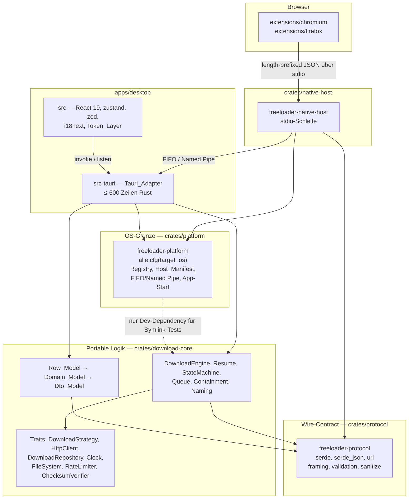
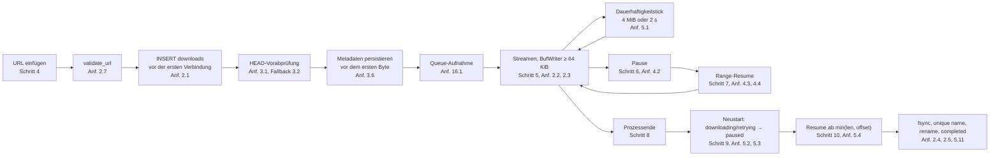
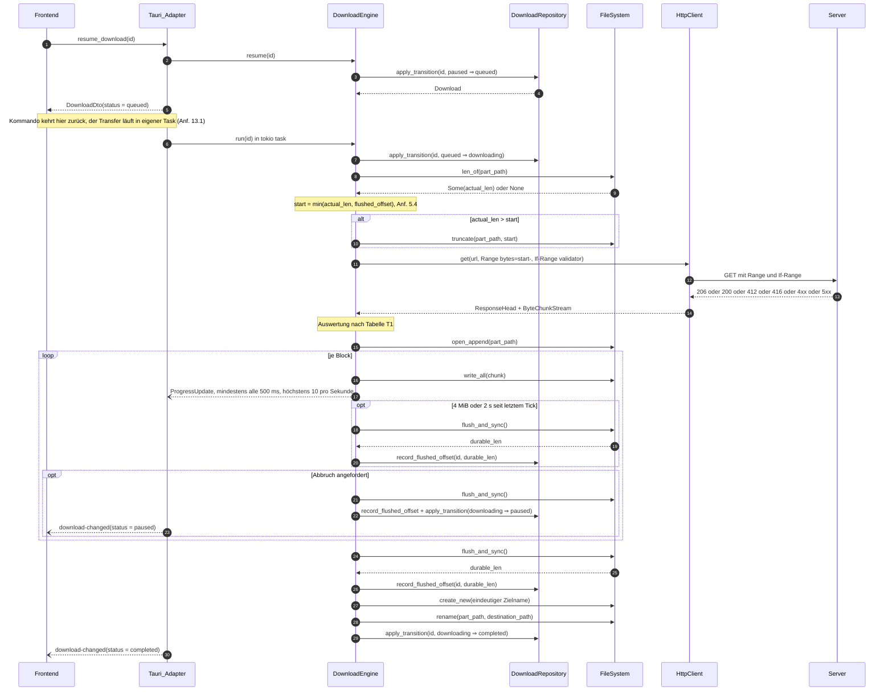
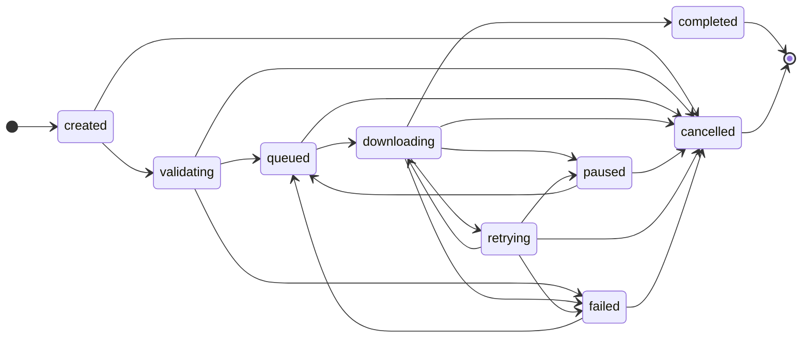
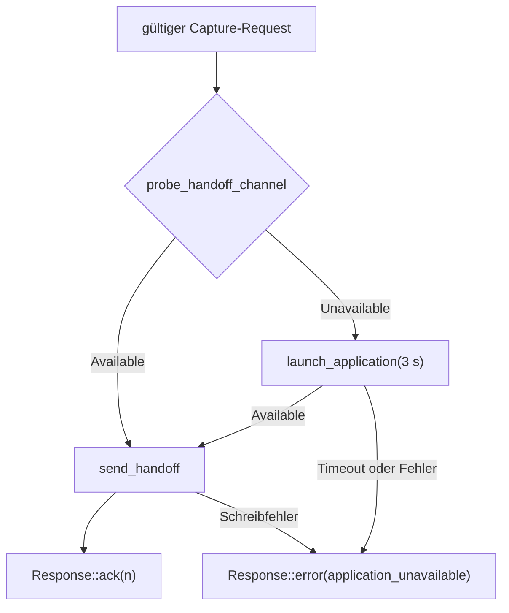
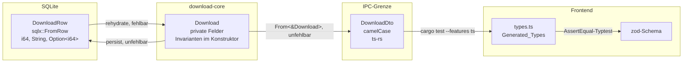

# Design Document

## Overview

Dieses Dokument legt den technischen Entwurf für den vertikalen Schnitt aus `requirements.md` fest. Es wiederholt die Anforderungen nicht, sondern verweist auf sie in der Form `(Anf. 5.4)`. Jede Entscheidung ist auf ein numeriertes Akzeptanzkriterium zurückgeführt; wo eine Entscheidung von keinem Kriterium erzwungen wird, ist sie als **gewählt** markiert und begründet.

Das Kernstück ist der Fortsetzungsalgorithmus. Alles andere in diesem Entwurf existiert, damit dieser Algorithmus korrekt, prüfbar und dauerhaft korrekt bleibt: die Trait-Nähte, damit er ohne Netz und ohne Platte getestet werden kann; die Zustandsmaschine und die Migrationen, damit sein Zustand nach einem Neustart rekonstruierbar ist; die Schichtprüfungen, damit die Nähte nicht wieder zuwachsen.

### Befundlage im aktuellen Code

Fünf Feststellungen aus dem Lesen des Repositories, die den Entwurf treiben. Sie sind gelesen, nicht ausgeführt; wo eine Aussage eine Laufzeitbeobachtung wäre, ist sie so gekennzeichnet.

| Befund | Ort | Folge |
| --- | --- | --- |
| `.truncate(true)` beim Öffnen der Part_File, kein `Range`, kein Abbruch-Token, kein `INSERT` | `crates/download-core/src/lib.rs`, `SingleStreamDownloader::download` | Fortsetzen ist nicht nur unvollständig, es ist strukturell unmöglich. Der Entwurf ersetzt die Funktion vollständig (Anf. 4, Anf. 5). |
| `CREATE TABLE IF NOT EXISTS downloads (…)` inline, danach nie gelesen oder geschrieben | `open_database` | Verstößt gegen Anf. 6.2 und 6.8. Ersetzt durch `sqlx`-Migrationen plus ein echtes Repository. |
| Containment prüft `destination.parent().starts_with(canonicalize(directory))` | `download` | Zwei Fehler: es wird das Elternverzeichnis statt des endgültigen Pfades geprüft (Anf. 8.2), und die rechte Seite ist kanonisiert, die linke nicht. Nach Lesart des Codes ergibt das auf Windows einen `Prefix(VerbatimDisk)`-gegen-`Prefix(Disk)`-Vergleich, der komponentenweise nie übereinstimmt — jeder Windows-Download würde als `UnsafePath` abgelehnt. Nicht ausgeführt verifiziert; der Entwurf beseitigt beide Ursachen. |
| Zweite, schwächere `sanitize_filename` mit 180-Zeichen-Grenze | `crates/download-core/src/lib.rs` | Verstößt gegen Anf. 7.1/7.2/7.3. Wird gelöscht, nicht angeglichen. |
| `"key": "REPLACE_WITH_RELEASE_PUBLIC_KEY"` und `allowed_origins: []` | `extensions/chromium/manifest.json`, `installer/linux/install-native-host.sh` | Native Messaging kann heute nicht funktionieren, gleich wie korrekt der Host ist. Beides sind bestätigte Blocker, siehe Abschnitt „Native Messaging". |

### Nummerierungshinweis

Die zuvor fehlenden Kriterien sind ergänzt: `requirements.md` enthält jetzt `24.17` bis `24.19` und `25.31` bis `25.33`. Die Zuordnung ist damit direkt und braucht keinen Umweg über benachbarte Kriterien mehr: `25.31` ist die maschinenlesbare Kontrastpaarung in `styles/contrast-pairs.json`, `25.32` sind die maschinellen Stilprüfungen im CI-Job `layering`, `25.33` ist das `Escape`-Verhalten des modalen Dialogs, und `24.17` bis `24.19` sind simulierter Neustart, Fehlerpfad und Abmeldung des Mock_Ipc.

### Bindende Randbedingungen

Diese fünf gelten ohne Ausnahme und sind jeweils mechanisch geprüft, nicht nur zugesagt:

1. Kein `tauri` im Abhängigkeitsgraphen von `freeloader-download-core`, weder direkt noch transitiv (Anf. 10.2).
2. Jedes `#[cfg(target_os = …)]`, `#[cfg(windows)]` und `#[cfg(unix)]` liegt in `crates/platform` (Anf. 10.3).
3. `#![deny(clippy::unwrap_used, clippy::expect_used, clippy::panic)]` und `#![forbid(unsafe_code)]` in `download-core` (Anf. 9.4).
4. Verschobene Funktionen sind Nähte, keine Attrappen: `PassThroughRateLimiter` lässt unverändert durch, `UnverifiedChecksum` prüft nichts, `Update_Check_Setting` löst 0 Requests aus (Anf. 23.2, 23.5, 23.6).
5. Genau 0 lauschende Sockets im ausgelieferten Binary (Anf. 17.1). Das schließt AF_UNIX ein und bestimmt damit die Wahl des lokalen Kanals in Abschnitt „Native Messaging".

### Entscheidungsregister

Nur die Entscheidungen, die *nicht* von einem Kriterium erzwungen sind. Alle übrigen Entscheidungen sind an ihrer Stelle mit `(Anf. X.Y)` belegt.

| # | Entscheidung | Status | Begründung |
| --- | --- | --- | --- |
| E1 | `async-trait` für die Nähte statt handgeschriebener `Pin<Box<dyn Future>>`-Signaturen | gewählt | `Arc<dyn Trait>` verlangt dyn-Kompatibilität; native `async fn` in Traits ist auf `rust-version = 1.82` nicht dyn-kompatibel. Die Alternative wäre in jeder Signatur sichtbarer Boilerplate ohne Gegenwert. |
| E2 | Sämtliche Einstellungen liegen in derselben SQLite-Datenbank, `tauri-plugin-store` entfällt | gewählt | Anf. 6.1 verlangt „ihren gesamten Zustand"; zwei Persistenzen wären zwei Wahrheiten. Nebeneffekt: eine Berechtigung weniger (Anf. 13.8). |
| E3 | `synchronous = NORMAL` statt `FULL` | gewählt | Bei der in „Dauerhaftigkeitskontrakt" festgelegten Reihenfolge kann ein verlorener Commit den `flushed_offset` nur *zurück*setzen, nie vorschieben. Rückwärts ist harmlos (einige MiB doppelt geladen), vorwärts wäre stille Korruption. Die günstigere Einstellung ist hier also die, deren Fehlermodus in die sichere Richtung zeigt. |
| E4 | `paused → downloading` ist **kein** legaler Übergang; Fortsetzen läuft immer über `queued` | gewählt | Macht Anf. 16.6 strukturell wahr statt nur zugesagt: wenn kein Pfad an der Warteschlange vorbeiführt, kann das Parallelitätslimit nicht überschritten werden. Weicht bewusst vom heutigen `can_transition_to` ab. |
| E5 | Der endgültige Zielname wird erst unmittelbar vor dem Umbenennen aufgelöst, die `.part`-Datei dagegen beim Anlegen reserviert | gewählt | Eine früh reservierte 0-Byte-Zieldatei wäre für pausierte Downloads sichtbarer Müll. Die späte Auflösung macht „kleinste freie Zahl" (Anf. 2.5) zudem rennfrei, weil `create_new` die Reservierung selbst ist. |
| E6 | Linux nutzt ein FIFO, Windows eine Named Pipe für die Auftragsübergabe | gewählt | Ein AF_UNIX-Listener wäre ein lauschender Socket und würde Randbedingung 5 verletzen. FIFO und Named Pipe sind keine Sockets, sind OS-lokal (Anf. 11.6) und erlauben eine Lebendigkeitsprobe ohne Zusatzprotokoll. |
| E7 | DTOs liegen in `download-core` unter `dto`, TypeScript-Erzeugung per `ts-rs` im Testlauf | gewählt | Hält den Tauri_Adapter unter 600 Zeilen (Anf. 10.4) und vermeidet ein fünftes Crate. `ts-rs` ist über das Feature `ts` gekapselt und damit keine Laufzeitabhängigkeit. |
| E8 | Textliteral- und Modulgrößenprüfung über die TypeScript-Compiler-API, kein ESLint | gewählt | `typescript` ist bereits Dev-Dependency. Eine zweite Lint-Toolchain für zwei Regeln einzuführen wäre teurer als 60 Zeilen Prüfskript. |
| E9 | `restart_notice` und `error_code` werden persistiert, nicht nur als Ereignis gesendet | gewählt | Anf. 5.7 bis 5.10 verlangen eine sichtbare Meldung. Ein reines Ereignis ist verloren, wenn es vor dem Aufbau der Liste eintrifft — genau der Fall nach einem Neustart. |
| E10 | Fortschritt wird in der Adapterschicht auf 4 Emissionen pro Sekunde app-weit zusammengefasst | gewählt | Anf. 2.3 und 1.5 setzen nur Unter- und Obergrenzen pro Transfer. Ohne app-weite Deckelung skaliert die IPC-Last mit der Zahl der Transfers, was Anf. 13.2 („Oberfläche bleibt bedienbar") bei acht parallelen Downloads gefährdet. |

---

## Architecture

### Crate- und Paketkarte



Die Kanten, die es **nicht** gibt, sind die eigentliche Aussage: `download-core → tauri` (Anf. 10.2), `download-core → platform` als Laufzeitkante, `protocol → irgendetwas außer serde/serde_json/url` (Anf. 10.1), und `frontend → Netzwerk` (Anf. 10.5). Jede dieser vier Nicht-Kanten hat eine eigene CI-Prüfung, siehe „Schichtdurchsetzung".

### Datenfluss des primären Akzeptanzpfades

Anf. 1 Schritt 4 bis 10 durchläuft genau diese Kette. Die Nummern verweisen auf die Schritte der Tabelle in Anf. 1.



### Wo Zustand lebt

| Zustand | Ort | Anforderung |
| --- | --- | --- |
| Download-Datensätze, Einstellungen | SQLite unter `%APPDATA%\freeloader` bzw. `$XDG_DATA_HOME/freeloader` | 6.1, E2 |
| Bytes eines laufenden Transfers | `.part`-Datei im Zielordner | 1.4 |
| Abbruch-Token, laufende Tasks, Fortschritts-Koaleszenz | Prozessspeicher des Tauri_Adapter | 4.1, 13.1 |
| Diagnoseprotokolle | Anwendungsdatenverzeichnis, lokal | 17.9 |
| Sprache, Thema, Zielordner, Parallelitätslimit | `settings`-Tabelle, gelesen über `get_settings` | 15.8, 16.2, 25.7 |

Genau 0 globale veränderliche Zustände und 0 Singletons in `download-core` (Anf. 9.3): jede Abhängigkeit kommt über `EngineDependencies` in den Konstruktor.

---

## Components and Interfaces

### 1. Trait-Nähte

Alle Nähte liegen in `crates/download-core/src/seams/`, ein Modul je Trait, gemeinsam re-exportiert über `pub use seams::*`. Sie sind `Send + Sync`, damit `Arc<dyn …>` über Tokio-Tasks wandern kann (Anf. 9.1, 9.2).

```rust
// crates/download-core/src/seams/http.rs
use bytes::Bytes;
use futures_util::Stream;
use std::{pin::Pin, time::Duration};
use url::Url;

/// Ein Strom von Antwortkörper-Blöcken. Boxed, damit `HttpClient` dyn-kompatibel bleibt.
pub type ByteChunkStream = Pin<Box<dyn Stream<Item = Result<Bytes, TransportError>> + Send>>;

#[derive(Debug, Clone, Copy, PartialEq, Eq)]
pub enum AcceptRanges {
    Unknown,
    Bytes,
    None,
}

#[derive(Debug, Clone, PartialEq, Eq)]
pub struct Validator {
    pub etag: Option<String>,
    pub last_modified: Option<String>,
}

impl Validator {
    /// `If-Range`-Wert. Ein starker `ETag` hat Vorrang vor `Last-Modified`.
    pub fn if_range_value(&self) -> Option<&str> { /* … */ }
    pub fn is_empty(&self) -> bool { /* … */ }
}

#[derive(Debug, Clone, PartialEq, Eq)]
pub struct ContentRange {
    pub first_byte: u64,
    pub last_byte: u64,
    pub complete_length: Option<u64>,
}

#[derive(Debug, Clone, PartialEq, Eq)]
pub struct ResponseHead {
    pub status: u16,
    pub final_url: Url,
    pub content_length: Option<u64>,
    pub content_range: Option<ContentRange>,
    pub accept_ranges: AcceptRanges,
    pub validator: Validator,
    pub content_disposition: Option<String>,
    pub retry_after: Option<Duration>,
}

#[derive(Debug, Clone, Copy, PartialEq, Eq)]
pub struct RangeSpec {
    /// Erstes angefordertes Byte. Es gibt in v0.1 keine offene Untergrenze.
    pub first_byte: u64,
}

#[async_trait::async_trait]
pub trait HttpClient: Send + Sync {
    /// `HEAD`-Vorabprüfung (Anf. 3.1).
    async fn head(&self, url: &Url) -> Result<ResponseHead, TransportError>;

    /// `GET`, optional mit `Range` und `If-Range` (Anf. 3.2, 4.3, 5.6).
    async fn get(
        &self,
        url: &Url,
        range: Option<RangeSpec>,
        if_range: Option<&Validator>,
    ) -> Result<(ResponseHead, ByteChunkStream), TransportError>;
}
```

`ResponseHead` enthält ausschließlich ausgewertete Werte, keine Header-Map. Das ist Absicht: die Engine kann keinen Header übersehen, den der Client nicht extrahiert hat, und der Fake muss keine Header-Semantik nachbauen.

```rust
// crates/download-core/src/seams/repository.rs
#[async_trait::async_trait]
pub trait DownloadRepository: Send + Sync {
    async fn insert(&self, download: &Download) -> Result<(), RepositoryError>;
    async fn get(&self, id: DownloadId) -> Result<Option<Download>, RepositoryError>;
    async fn list(&self) -> Result<Vec<Download>, RepositoryError>;
    async fn remove(&self, id: DownloadId) -> Result<(), RepositoryError>;

    /// Genau ein Statuswechsel, genau eine SQLite-Transaktion, mit
    /// Compare-and-Swap auf `expected_from` (Anf. 6.6, 6.7).
    async fn apply_transition(
        &self,
        id: DownloadId,
        expected_from: DownloadStatus,
        to: DownloadStatus,
        patch: RecordPatch,
        at: Timestamp,
    ) -> Result<Download, RepositoryError>;

    /// Dauerhaftigkeitstick ohne Statuswechsel (Anf. 5.1).
    /// Darf ausschließlich mit einer bereits gefsynceten Länge aufgerufen werden.
    async fn record_flushed_offset(
        &self,
        id: DownloadId,
        durable_offset: u64,
        at: Timestamp,
    ) -> Result<(), RepositoryError>;

    /// Metadaten vor dem ersten geschriebenen Byte (Anf. 3.6).
    async fn save_metadata(
        &self,
        id: DownloadId,
        metadata: &ResourceMetadata,
        at: Timestamp,
    ) -> Result<(), RepositoryError>;

    /// Startbereinigung: `downloading` und `retrying` werden zu `paused`,
    /// alles andere bleibt unberührt (Anf. 5.2).
    async fn quiesce_running(&self, at: Timestamp) -> Result<Vec<DownloadId>, RepositoryError>;

    async fn read_setting(&self, key: SettingKey) -> Result<Option<String>, RepositoryError>;
    async fn write_setting(
        &self,
        key: SettingKey,
        value: &str,
        at: Timestamp,
    ) -> Result<(), RepositoryError>;
}

/// Nur gesetzte Felder werden geschrieben; `None` lässt die Spalte unverändert.
#[derive(Debug, Clone, Default, PartialEq, Eq)]
pub struct RecordPatch {
    pub flushed_offset: Option<u64>,
    pub total_bytes: Option<Option<u64>>,
    pub final_url: Option<Url>,
    pub accept_ranges: Option<AcceptRanges>,
    pub validator: Option<Validator>,
    pub restart_notice: Option<Option<RestartNotice>>,
    pub error_code: Option<Option<ErrorCode>>,
    pub retry_count: Option<u8>,
}
```

```rust
// crates/download-core/src/seams/clock.rs
/// Monotone Zeit als Abstand zum Start der Engine. Bewusst kein
/// `std::time::Instant`: der ist nicht fälschbar, und Anf. 9.6 verlangt
/// deterministisch testbaren Backoff.
#[derive(Debug, Clone, Copy, PartialEq, Eq, PartialOrd, Ord)]
pub struct MonotonicInstant(Duration);

impl MonotonicInstant {
    pub fn saturating_since(self, earlier: Self) -> Duration { /* … */ }
}

#[async_trait::async_trait]
pub trait Clock: Send + Sync {
    /// Wanduhrzeit für `*_at`-Spalten.
    fn now(&self) -> Timestamp;
    /// Monotone Zeit für Backoff, Fortschrittstakt und Dauerhaftigkeitstick.
    fn monotonic(&self) -> MonotonicInstant;
    async fn sleep(&self, duration: Duration);
}
```

```rust
// crates/download-core/src/seams/filesystem.rs
#[async_trait::async_trait]
pub trait FileSystem: Send + Sync {
    async fn create_dir_all(&self, path: &Path) -> Result<(), FsError>;
    async fn canonicalize(&self, path: &Path) -> Result<PathBuf, FsError>;
    /// `None`, wenn der Pfad nicht existiert (Anf. 5.10).
    async fn len_of(&self, path: &Path) -> Result<Option<u64>, FsError>;
    /// `lstat`-Semantik: folgt dem Symlink nicht (Anf. 8.5).
    async fn symlink_probe(&self, path: &Path) -> Result<LeafKind, FsError>;
    /// `O_CREAT | O_EXCL` bzw. `CREATE_NEW`. Reserviert einen Namen rennfrei.
    async fn create_new(&self, path: &Path) -> Result<(), FsError>;
    /// Anfügemodus, niemals `truncate` (Anf. 4.4).
    async fn open_append(&self, path: &Path) -> Result<Box<dyn PartFile>, FsError>;
    async fn truncate(&self, path: &Path, len: u64) -> Result<(), FsError>;
    async fn rename(&self, from: &Path, to: &Path) -> Result<(), FsError>;
    async fn remove_file(&self, path: &Path) -> Result<(), FsError>;
}

#[derive(Debug, Clone, Copy, PartialEq, Eq)]
pub enum LeafKind {
    Missing,
    File,
    Directory,
    Symlink,
}

#[async_trait::async_trait]
pub trait PartFile: Send {
    /// Schreibt in den internen `BufWriter` mit ≥ 64 KiB Puffer (Anf. 2.2).
    async fn write_all(&mut self, chunk: &[u8]) -> Result<(), FsError>;
    /// Leert den Puffer, ruft `fsync` und gibt die **dauerhafte** Bytelänge
    /// zurück. Nur dieser Rückgabewert darf als `flushed_offset` persistiert
    /// werden — der Dauerhaftigkeitskontrakt steckt damit im Typ.
    async fn flush_and_sync(&mut self) -> Result<u64, FsError>;
    /// Insgesamt akzeptierte Bytes, gepuffert oder dauerhaft. Nur für
    /// Fortschrittsanzeige, niemals für Persistenz.
    fn accepted_len(&self) -> u64;
}
```

```rust
// crates/download-core/src/seams/rate_limiter.rs
/// Naht für die auf einen späteren Spec verschobene Bandbreitenbegrenzung.
#[async_trait::async_trait]
pub trait RateLimiter: Send + Sync {
    async fn acquire(&self, bytes: u32);
}

/// Die **einzige** ausgelieferte Implementierung (Anf. 23.2).
///
/// Lässt den Durchsatz unverändert durch: `acquire` kehrt sofort zurück, ohne
/// zu warten, zu zählen oder zu drosseln. v0.1 begrenzt keine Bandbreite; die
/// Oberfläche zeigt deshalb kein Bedienelement dafür (Anf. 23.3).
pub struct PassThroughRateLimiter;

#[async_trait::async_trait]
impl RateLimiter for PassThroughRateLimiter {
    async fn acquire(&self, _bytes: u32) {}
}
```

```rust
// crates/download-core/src/seams/checksum.rs
#[derive(Debug, Clone, Copy, PartialEq, Eq)]
pub enum ChecksumVerdict {
    /// v0.1 gibt ausschließlich diesen Wert zurück (Anf. 23.6).
    NotVerified,
    Match,
    Mismatch,
}

pub trait ChecksumVerifier: Send + Sync {
    fn expected(&self) -> Option<&ChecksumSpec>;
    fn verify(&self, observed: &ChecksumSpec) -> ChecksumVerdict;
}

/// Naht ohne Wirkung: prüft genau 0 Checksummen (Anf. 23.6).
pub struct UnverifiedChecksum;
```

```rust
// crates/download-core/src/seams/strategy.rs
/// Alles, was ein Transfer zum Laufen braucht, in einem Wert. Eine
/// segmentierende Strategie ergänzt hier nichts an den Aufrufstellen,
/// sondern zerlegt `plan.remaining()` intern (Anf. 23.1).
#[derive(Debug, Clone)]
pub struct TransferPlan {
    pub id: DownloadId,
    pub url: Url,
    pub part_path: PathBuf,
    pub start_offset: u64,
    pub total_bytes: Option<u64>,
    pub accept_ranges: AcceptRanges,
    pub validator: Validator,
}

pub struct TransferContext {
    pub http: Arc<dyn HttpClient>,
    pub file_system: Arc<dyn FileSystem>,
    pub repository: Arc<dyn DownloadRepository>,
    pub clock: Arc<dyn Clock>,
    pub rate_limiter: Arc<dyn RateLimiter>,
    pub cancel: CancelToken,
    pub progress: ProgressSink,
    pub settings: TransferSettings,
}

#[derive(Debug, Clone, PartialEq, Eq)]
pub enum TransferOutcome {
    Completed { durable_len: u64 },
    Paused { durable_len: u64 },
    Restarted { reason: RestartNotice },
}

#[async_trait::async_trait]
pub trait DownloadStrategy: Send + Sync {
    fn id(&self) -> &'static str;
    /// Beantwortet genau eine Frage: „bringe diesen Plan voran, bis fertig,
    /// pausiert oder gescheitert". Kein Statuswechsel, keine Namensauflösung.
    async fn execute(
        &self,
        plan: TransferPlan,
        context: TransferContext,
    ) -> Result<TransferOutcome, EngineError>;
}

/// Die einzige Implementierung in v0.1 (Glossar: Download_Strategy).
pub struct SingleStreamStrategy;
```

#### Konstruktor-Injektion

```rust
// crates/download-core/src/engine.rs
pub struct EngineDependencies {
    pub http: Arc<dyn HttpClient>,
    pub repository: Arc<dyn DownloadRepository>,
    pub file_system: Arc<dyn FileSystem>,
    pub clock: Arc<dyn Clock>,
    pub rate_limiter: Arc<dyn RateLimiter>,
    pub strategy: Arc<dyn DownloadStrategy>,
    pub checksums: Arc<dyn ChecksumVerifier>,
}

#[derive(Debug, Clone, Copy, PartialEq, Eq)]
pub struct EngineSettings {
    pub concurrency_limit: ConcurrencyLimit, // 1..=8, Anf. 16.2
    pub durability_bytes: u64,               // 4 MiB, Anf. 5.1
    pub durability_interval: Duration,       // 2 s, Anf. 5.1
    pub progress_interval: Duration,         // 200 ms, Anf. 2.3
    pub write_buffer_bytes: usize,           // ≥ 64 KiB, Anf. 2.2
    pub connect_timeout: Duration,           // 10 s, Anf. 3.11
    pub idle_timeout: Duration,              // 30 s, Anf. 3.11
    pub max_redirects: u8,                   // 10, Anf. 3.10
    pub max_retries: u8,                     // 5, Anf. 3.7
}

impl DownloadEngine {
    /// Der einzige Konstruktor. Es gibt kein `Default`, kein `new_with_globals`
    /// und keinen `static` Zustand (Anf. 9.2, 9.3).
    pub fn new(dependencies: EngineDependencies, settings: EngineSettings) -> Self { /* … */ }

    pub async fn create(&self, request: CreateDownload) -> Result<Download, EngineError>;
    pub async fn run(&self, id: DownloadId) -> Result<TransferOutcome, EngineError>;
    pub async fn pause(&self, id: DownloadId) -> Result<Download, EngineError>;
    pub async fn resume(&self, id: DownloadId) -> Result<Download, EngineError>;
    pub async fn cancel(&self, id: DownloadId) -> Result<Download, EngineError>;
    pub async fn remove(&self, id: DownloadId) -> Result<(), EngineError>;
    pub async fn list(&self) -> Result<Vec<Download>, EngineError>;
    /// Startbereinigung plus Wiederherstellung der Liste (Anf. 5.2, 5.3).
    pub async fn recover_on_start(&self) -> Result<Vec<Download>, EngineError>;
}
```

#### Produktion und Fake nebeneinander

Die Fakes liegen in `crates/download-core/src/testing/`, kompiliert unter `#[cfg(any(test, feature = "fakes"))]`. `Cargo.toml` erhält `[features] fakes = []` und `[dev-dependencies] freeloader-download-core = { path = ".", features = ["fakes"] }`, damit auch Integrationstests unter `tests/` sie sehen. Das ausgelieferte Binary aktiviert das Feature nie; eine CI-Prüfung liest `cargo tree -p freeloader-desktop -e features` und schlägt fehl, wenn `fakes` auftaucht.

| Naht | Produktion | Fake | Was der Fake aus dem Test entfernt |
| --- | --- | --- | --- |
| `HttpClient` | `ReqwestHttpClient` — `rustls`, `redirect::Policy::limited(10)`, `connect_timeout`, Leerlauf-Timeout per `tokio::time::timeout` um `next()` (Anf. 3.10, 3.11) | `ScriptedHttpClient` — Liste von `ResponseHead` plus Blockfolgen, Aufrufprotokoll, einbaubare Transportfehler und Statuscodes | Netz, DNS, TLS, echte Server |
| `DownloadRepository` | `SqliteRepository` über `SqlitePool` | `InMemoryRepository` — `Mutex<BTreeMap<DownloadId, Download>>` mit derselben CAS-Semantik | Datenbankdatei, Migrationen, I/O |
| `FileSystem` | `TokioFileSystem` — `tokio::fs` plus `BufWriter` | `InMemoryFileSystem` — `HashMap<PathBuf, Vec<u8>>` mit getrennter „dauerhafter" und „gepufferter" Länge und einem `crash()`-Schalter, der den Puffer verwirft | Platte, `fsync`-Kosten, Aufräumen |
| `Clock` | `SystemClock` | `TestClock` — `now` und `monotonic` manuell vorgestellt, `sleep` verbucht die Dauer statt zu warten | Wartezeit; Backoff-Tests laufen in Mikrosekunden |
| `RateLimiter` | `PassThroughRateLimiter` | derselbe Typ | nichts; es gibt keine zweite Implementierung (Anf. 23.2) |
| `DownloadStrategy` | `SingleStreamStrategy` | derselbe Typ, plus `PausingStrategy` für Zustandsmaschinentests | nichts am Transferverhalten |
| `ChecksumVerifier` | `UnverifiedChecksum` | derselbe Typ | nichts (Anf. 23.6) |

Der `InMemoryFileSystem` unterscheidet ausdrücklich zwischen gepufferter und dauerhafter Länge. Genau das macht Eigenschaft 2 prüfbar: ein simulierter Absturz verwirft den Puffer, und der Test kann feststellen, ob der persistierte Offset jemals vor der dauerhaften Länge lag.

#### Warum `cargo test -p freeloader-download-core` ohne Anzeigeserver, ohne Netz und ohne Browser läuft

- **Kein Anzeigeserver:** `download-core` hängt an keinem GUI-Crate. `tauri`, `webkit2gtk` und `gtk` sind nicht im Graphen (Anf. 10.2). Der CI-Job für diesen Befehl installiert bewusst keine GUI-Systembibliotheken; fehlte die Trennung, würde der Job am Linkschritt scheitern, nicht an einer Zusicherung (Anf. 10.6).
- **Kein Browser:** Browsererkennung und Host_Manifest liegen in `crates/platform`. `download-core` kennt beides nicht.
- **Kein Netz nach außen:** Unit- und Eigenschaftstests verwenden `ScriptedHttpClient` und öffnen 0 Verbindungen. Die wenigen Integrationstests, die echtes HTTP brauchen, sprechen den Fixture-Server auf `127.0.0.1:0` im eigenen Prozess an. Loopback ist kein Zugang nach außen; Anf. 19.4 ist damit erfüllt und Anf. 19.2 hält den Server unter `#[cfg(test)]`.
- **Echte Platte nur dort, wo Fälschen den Test entwerten würde:** Containment-Tests laufen gegen `TokioFileSystem` in einem `tempfile::TempDir`. Kanonisierung und Symlink-Auflösung *sind* das Prüfobjekt; ein Fake würde nur den Fake testen. Symlinks werden über `freeloader_platform::symlink_support()` angelegt, das eine Fähigkeitsauskunft zurückgibt — unter Windows ohne Entwicklermodus `Unsupported`, worauf der Test sich zur Laufzeit als übersprungen meldet. Damit steht kein einziges `cfg(windows)` in `download-core` (Anf. 10.3), und der übersprungene Fall landet als nicht ausführbarer Schritt in der Manual_Checklist (Anf. 19.6).

---

### 2. Der Fortsetzungsalgorithmus

Das Kernstück (Anf. 5). Der Algorithmus wird von `SingleStreamStrategy::execute` ausgeführt, nachdem `DownloadEngine::resume` den Übergang `paused → queued → downloading` persistiert hat.

#### Schrittfolge

| Schritt | Aktion | Anforderung |
| --- | --- | --- |
| R1 | Datensatz laden. Fehlt er, `EngineError::UnknownDownload`. | 5.3 |
| R2 | `apply_transition(id, paused, queued)`, dann Warteschlangenaufnahme, dann `apply_transition(id, queued, downloading)`. Beide mit CAS; scheitert eines, bricht der Resume ohne Nebenwirkung ab. | 6.6, 16.3, E4 |
| R3 | `actual_len = file_system.len_of(part_path)`. | 5.4 |
| R4 | Fehlt die Part_File (`None`), dann `flushed_offset := 0`, `restart_notice := PartFileMissing`, weiter bei R7 mit `start = 0`. | 5.10 |
| R5 | `start = min(actual_len, flushed_offset)`. | 5.4 |
| R6 | Ist `actual_len > start`, `truncate(part_path, start)`. | 5.5 |
| R7 | Ist `accept_ranges != Bytes` oder `start == 0`, dann einfacher `GET` ohne `Range`; sonst `GET` mit `Range: bytes={start}-` und, falls ein Validator vorliegt, `If-Range: {validator}`. | 4.3, 5.6, 5.8 |
| R8 | Antwort gegen Tabelle T1 auswerten. Ergebnis ist entweder „ab `start` anfügen", „bei 0 neu beginnen" oder ein Fehlerpfad. | 5.7–5.10, 3.7–3.9 |
| R9 | `open_append(part_path)` — niemals `truncate`. Erster Schreibvorgang landet bei Byte `start`. | 4.4 |
| R10 | Blockschleife: `rate_limiter.acquire(len)`, `write_all(chunk)`, Leerlauf-Timeout je `next()`, Fortschrittstakt, Dauerhaftigkeitstick, Abbruchprüfung. | 2.2, 2.3, 3.11, 4.2, 5.1 |
| R11 | Dauerhaftigkeitstick, wenn seit dem letzten Tick ≥ 4 MiB geschrieben **oder** ≥ 2 s vergangen sind: `flush_and_sync()` → `record_flushed_offset(durable_len)`. | 5.1 |
| R12 | Abbruch angefordert: Schleife verlassen, `flush_and_sync()`, `record_flushed_offset`, `apply_transition(downloading, paused)`. Budget 500 ms. | 4.2, 1.6 |
| R13 | Strom regulär beendet: `flush_and_sync()`, `record_flushed_offset`. Ist `total_bytes` bekannt und `durable_len != total_bytes`, dann `EngineError::ShortBody` und Status `failed` mit erhaltener Part_File. | 3.12 |
| R14 | Zielnamen auflösen: Containment-Prozedur mit `create_new`-Reservierung, kleinste freie Zahl 1..999. | 2.5, 2.6, 8.1–8.6 |
| R15 | `rename(part_path, destination_path)`. | 2.4 |
| R16 | `apply_transition(downloading, completed, patch { flushed_offset: durable_len, … })`. | 5.11 |

Der Fortschrittstakt in R10 ist von der Dauerhaftigkeit in R11 getrennt. Fortschritt darf die *akzeptierte* Länge melden (`accepted_len`), weil er nur der Anzeige dient; persistiert wird ausschließlich die *dauerhafte* Länge. Diese Trennung ist der Grund, warum `PartFile` zwei verschiedene Längenabfragen hat.

#### T1 — Entscheidungstabelle für jeden Zweig von 5.4 bis 5.10

Ausgewertet in dieser Reihenfolge; die erste zutreffende Zeile gewinnt.

| # | Beobachtete Bedingung | Aktion an der Part_File | Persistiert | Meldung an die Freeloader_App | Anf. |
| --- | --- | --- | --- | --- | --- |
| T1.1 | `len_of(part) == None` | keine, Datei wird neu erzeugt | `flushed_offset := 0` | `restarted_part_missing` | 5.10 |
| T1.2 | `actual_len < flushed_offset` | keine | `flushed_offset := actual_len` | keine — im Rahmen des Kontrakts, kein Nutzerereignis | 5.4 |
| T1.3 | `actual_len > flushed_offset` | `truncate` auf `flushed_offset` | unverändert | keine | 5.4, 5.5 |
| T1.4 | `accept_ranges == None` oder Header fehlte (`Unknown` nach HEAD **und** GET) | `truncate` auf 0 | `flushed_offset := 0`, `accept_ranges := none` | `resume_unsupported` | 5.8 |
| T1.5 | `start == 0` bei `accept_ranges == Bytes` | keine (Datei ist leer oder wurde gekürzt) | unverändert | keine | 5.4 |
| T1.6 | Antwort `206`, `content_range.first_byte == start` | anfügen ab `start` | `total_bytes := content_range.complete_length` falls bekannt | keine | 4.4, 5.6 |
| T1.7 | Antwort `206`, `content_range.first_byte != start` | `truncate` auf 0 | `flushed_offset := 0` | `restarted_range_mismatch` | **gewählt** — von keinem Kriterium erzwungen. Ein Server, der einen anderen Bereich liefert als angefordert, ist die einzige Lage, in der Anfügen ein Loch erzeugen würde; Neubeginn kostet Bandbreite, Anfügen kostet Korrektheit. |
| T1.8 | Antwort `200` obwohl `Range` gesendet | `truncate` auf 0 | `flushed_offset := 0`, neuer Validator | `restarted_full_response` | 5.7 |
| T1.9 | Antwort `412 Precondition Failed` | `truncate` auf 0 | `flushed_offset := 0`, neuer Validator aus der Folgeantwort | `restarted_validator_changed` | 5.9 |
| T1.10 | Antwort `206`/`200` mit abweichendem `ETag`/`Last-Modified` gegenüber dem gespeicherten Validator | `truncate` auf 0 | `flushed_offset := 0`, neuer Validator | `restarted_validator_changed` | 5.9 |
| T1.11 | Antwort `416 Range Not Satisfiable` | `truncate` auf 0, `HEAD` erneut, dann von 0 | `flushed_offset := 0`, neue Gesamtgröße | `restarted_range_rejected` | **gewählt** — Anf. 19.1 verlangt 416 im Fixture-Server, aber kein Kriterium schreibt die Reaktion vor. `416` bedeutet, dass der gespeicherte Offset jenseits der Ressource liegt; die Ressource hat sich also geändert, und derselbe Pfad wie bei 5.9 ist der einzige, der terminiert. |
| T1.12 | Antwort 408, 429, 500, 502, 503, 504 oder Transportfehler, `retry_count < 5` | keine, Datei bleibt erhalten | `status := retrying`, `retry_count += 1` | `retrying` mit Versuchsnummer | 3.7, 3.8 |
| T1.13 | wie T1.12, aber `retry_count == 5` | keine, Datei bleibt mit Offset erhalten | `status := failed`, `error_code` | Fehler mit stabilem Code | 3.12 |
| T1.14 | Antwort 400–407 oder 409–499 (außer 412, 416) | keine | `status := failed`, `error_code` | Fehler ohne Wiederholangebot | 3.9 |
| T1.15 | Abbruch-Token ausgelöst, gleich in welchem Zweig | `flush_and_sync` | `flushed_offset := durable_len`, `status := paused` | Statuswechsel | 4.2, 4.5 |

Zu T1.12: Die Wartezeit ist `Retry-After`, wenn der Header vorliegt und ≤ 60 s beträgt, sonst `2^(retry_count-1)` Sekunden aus {1, 2, 4, 8, 16} mit ±20 % Jitter (Anf. 3.7, 3.8). Der Jitter zieht aus `rand`, gewartet wird über `Clock::sleep`, damit der `TestClock` den Backoff ohne Realzeit prüfen kann.

#### Sequenzdiagramm



#### Dauerhaftigkeitskontrakt

**Die Reihenfolge ist: schreiben → `fsync` → Offset persistieren. Sie ist nicht verhandelbar und nicht vertauschbar.**

Formal lautet die Invariante, die der Kontrakt herstellt:

> Zu jedem Zeitpunkt, an dem der Prozess enden kann, gilt `persisted_flushed_offset ≤ durable_part_file_length`.

Drei Punkte, warum die Umkehrung Daten zerstört:

1. **Was die Umkehrung anrichtet.** Persistiert man den Offset zuerst und synct danach, entsteht ein Fenster, in dem die Datenbank `N` Bytes als dauerhaft behauptet, während im Dateisystem nur `M < N` Bytes dauerhaft sind — der Rest steht im Seiten-Cache. Endet der Prozess in diesem Fenster durch Stromausfall oder Kernel-Panik, dann findet der nächste Start `flushed_offset = N` und eine Datei der Länge `M`. Ein Resume, der `N` glaubt, sendet `Range: bytes=N-` und fügt die Serverbytes ab `N` an Dateiposition `M` an. Das Ergebnis hat kein Loch, das man sehen könnte: die Datei ist exakt `total_bytes` lang, der Status wird `completed`, die Oberfläche meldet Erfolg — und der Inhalt ist ab Byte `M` um `N − M` Bytes verschoben und damit Müll. Anf. 1.2 (SHA-256-Gleichheit) schlägt fehl, aber erst, wenn jemand nachmisst. Stille Korruption bei gemeldetem Erfolg ist die schlechteste Fehlerklasse, die dieses Projekt haben kann.
2. **Warum `min` allein nicht reicht.** Anf. 5.4 verlangt `start = min(actual_len, flushed_offset)`. Diese Regel ist die zweite Verteidigungslinie und sie funktioniert **nur unter der obigen Invariante**. Ist der Offset nie voraus, dann ist `min` entweder gleich dem Offset (Normalfall) oder gleich der kürzeren Dateilänge (Offset ging verloren), und in beiden Fällen wird höchstens neu geladen, nie falsch angefügt. Ist der Offset dagegen voraus, wählt `min` die Dateilänge `M` — was zufällig richtig wäre — aber `flushed_offset` bliebe in der Datenbank auf `N` und jeder andere Leser (Liste, Fortschrittsanzeige, Wiederaufnahmelogik nach einem weiteren Absturz) sähe weiterhin die Lüge. `min` repariert das Symptom für einen Pfad, nicht die Invariante.
3. **Warum die Datenbankeinstellung in dieselbe Richtung zeigt.** Mit `synchronous = NORMAL` (Entscheidung E3) kann ein Commit bei Stromausfall verloren gehen. Verloren heißt: der Offset fällt *zurück*. Das ist genau die Richtung, die die Invariante erlaubt, und kostet höchstens die seit dem letzten WAL-Checkpoint geladenen Bytes. Ein `fsync` der Part_File vor dem Commit ist die teure Operation, die wir behalten; ein zweites `fsync` für das WAL-Journal ist die, die wir sparen dürfen.

Zwei praktische Ergänzungen: Nach `rename` in R15 wird auf Linux zusätzlich das Elternverzeichnis gesynct, damit der Verzeichniseintrag selbst dauerhaft ist — diese Operation liegt hinter `FileSystem::rename` und ist damit plattformabhängig implementierbar, ohne `cfg` in der Engine. Und `rename` benennt auf eine Datei um, die R14 per `create_new` reserviert hat; das ist der einzige Weg, „kleinste freie Zahl" (Anf. 2.5) ohne Rennen zwischen Prüfung und Verwendung umzusetzen.

---

### 3. Zustandsmaschine

Neun Zustände (Anf. 9.8). Der Typ `DownloadStatus` bleibt bestehen, die Übergangsrelation wird gegenüber dem heutigen `can_transition_to` an drei Stellen korrigiert.



#### Vollständige Matrix der erlaubten Übergänge

Zeile = Ausgangszustand, Spalte = Zielzustand. `✓` erlaubt, leer verboten. Selbstübergänge sind durchgehend verboten: ein Statuswechsel, der nichts ändert, würde `updated_at` verschieben, ohne dass etwas geschehen ist.

| von \ nach | created | validating | queued | downloading | paused | retrying | completed | failed | cancelled |
| --- | --- | --- | --- | --- | --- | --- | --- | --- | --- |
| **created** | | ✓ | | | | | | | ✓ |
| **validating** | | | ✓ | | | | | ✓ | ✓ |
| **queued** | | | | ✓ | | | | | ✓ |
| **downloading** | | | | | ✓ | ✓ | ✓ | ✓ | ✓ |
| **paused** | | | ✓ | | | | | | ✓ |
| **retrying** | | | | ✓ | ✓ | | | ✓ | ✓ |
| **completed** | | | | | | | | | |
| **failed** | | | ✓ | | | | | | ✓ |
| **cancelled** | | | | | | | | | |

20 erlaubte von 81 möglichen Paaren. Belege je Übergang:

| Übergang | Auslöser | Anf. |
| --- | --- | --- |
| created → validating | Datensatz angelegt, HEAD-Vorabprüfung beginnt | 2.1, 3.1 |
| validating → queued | Metadaten persistiert | 3.6, 16.3 |
| validating → failed | Schema abgelehnt, 4xx ohne Wiederholung | 2.7, 3.9 |
| queued → downloading | Warteschlange gibt einen Platz frei | 16.4 |
| downloading → paused | Pause oder Startbereinigung | 4.2, 5.2 |
| downloading → retrying | wiederholbarer Fehler | 3.7 |
| downloading → completed | alle Bytes dauerhaft, umbenannt | 2.4, 5.11 |
| downloading → failed | Versuche erschöpft, Kurzantwort, Schreibfehler | 3.12 |
| paused → queued | Fortsetzen | 4.3, 16.3 |
| retrying → downloading | Backoff abgelaufen | 3.7 |
| retrying → paused | Pause während des Backoff | 4.7 |
| retrying → failed | Versuche erschöpft | 3.12 |
| failed → queued | manueller neuer Versuch, Part_File und Offset noch vorhanden | 3.12 |
| jeder nicht-terminale → cancelled | Abbrechen-Kommando | 13.4 |

Drei bewusste Abweichungen vom heutigen Code:

1. **`paused → downloading` entfernt** (Entscheidung E4). Jeder Weg in `downloading` führt über `queued`, damit das Parallelitätslimit nicht umgangen werden *kann* (Anf. 16.6).
2. **`failed → queued` ergänzt.** Anf. 3.12 verlangt, dass Part_File und Offset für einen späteren manuellen Versuch erhalten bleiben. Ohne diesen Übergang wäre „erhalten" bedeutungslos.
3. **`retrying → paused` ergänzt.** Anf. 4.7 nennt `downloading` *und* `retrying` als Zustände, aus denen eine Pause erlaubt ist. Fehlte der Übergang, würde 4.7 sich selbst widersprechen.

#### Verbotene Übergänge scheitern, ohne zu panicken

```rust
#[derive(Debug, Error, PartialEq, Eq)]
#[error("transition from {from} to {to} is not allowed")]
pub struct InvalidTransition {
    pub from: DownloadStatus,
    pub to: DownloadStatus,
}

impl DownloadStatus {
    pub const fn can_transition_to(self, next: Self) -> bool { /* Matrix oben */ }

    pub fn try_transition(self, next: Self) -> Result<Self, InvalidTransition> {
        if self.can_transition_to(next) { Ok(next) } else { Err(InvalidTransition { from: self, to: next }) }
    }
}
```

`InvalidTransition` wandert als `EngineError::InvalidTransition` bis in den Tauri_Adapter und wird dort zu `ErrorDto { code: "invalid_transition", … }`. Es gibt keinen Pfad, auf dem ein verbotener Übergang zu `unwrap`, `expect`, `panic!` oder `unreachable!` führt; `#![deny(clippy::unwrap_used, clippy::expect_used, clippy::panic)]` in `download-core` macht das zu einem Compilerfehler statt zu einer Zusage (Anf. 9.4). Anf. 4.7 verlangt zusätzlich, dass der Fehler den *aktuellen* Status nennt — deshalb trägt `InvalidTransition` `from` mit sich.

#### Jeder Übergang ist eine SQLite-Transaktion

`SqliteRepository::apply_transition` prüft die Matrix im Speicher, führt dann genau eine Transaktion aus und liest den neuen Zustand in derselben Transaktion zurück (Anf. 6.6, 6.7):

```rust
async fn apply_transition(
    &self,
    id: DownloadId,
    expected_from: DownloadStatus,
    to: DownloadStatus,
    patch: RecordPatch,
    at: Timestamp,
) -> Result<Download, RepositoryError> {
    expected_from.try_transition(to)?;                       // Matrixprüfung zuerst
    let mut transaction = self.pool.begin().await?;          // BEGIN IMMEDIATE
    let affected = sqlx::query(UPDATE_WITH_CAS)
        .bind(id).bind(to.as_str())
        .bind(patch.flushed_offset.map(|v| v as i64))
        /* … weitere Patch-Felder … */
        .bind(at.as_millis()).bind(expected_from.as_str())
        .execute(&mut *transaction).await?
        .rows_affected();
    if affected != 1 {
        transaction.rollback().await?;
        return Err(RepositoryError::StaleTransition { id, expected: expected_from });
    }
    let row: DownloadRow = sqlx::query_as(SELECT_BY_ID)
        .bind(id).fetch_one(&mut *transaction).await?;
    transaction.commit().await?;
    Download::rehydrate(row)                                  // fehlbar, siehe Data Models
}
```

```sql
-- UPDATE_WITH_CAS
UPDATE downloads
   SET status         = ?2,
       flushed_offset = COALESCE(?3,  flushed_offset),
       total_bytes    = CASE WHEN ?4  IS NULL THEN total_bytes    ELSE ?5  END,
       final_url      = COALESCE(?6,  final_url),
       accept_ranges  = COALESCE(?7,  accept_ranges),
       etag           = COALESCE(?8,  etag),
       last_modified  = COALESCE(?9,  last_modified),
       restart_notice = CASE WHEN ?10 IS NULL THEN restart_notice ELSE ?11 END,
       error_code     = CASE WHEN ?12 IS NULL THEN error_code     ELSE ?13 END,
       retry_count    = COALESCE(?14, retry_count),
       updated_at     = ?15
 WHERE id     = ?1
   AND status = ?16;
```

Das `AND status = ?16` ist der Compare-and-Swap. Zwei gleichzeitige Kommandos auf denselben Download — etwa Pause und Abbruch — können nicht beide gewinnen: das zweite bekommt `rows_affected == 0`, rollt zurück und meldet `StaleTransition`, und der Datensatz bleibt unverändert (Anf. 6.7). Die `CASE WHEN`-Paare gegenüber `COALESCE` sind nötig, wo `None` (nicht anfassen) und `Some(None)` (auf NULL setzen) unterschieden werden müssen — `restart_notice` und `error_code` müssen löschbar sein, sonst bliebe ein alter Hinweis nach einem erfolgreichen Neuversuch stehen.

`record_flushed_offset` ist die einzige Schreiboperation ohne Statuswechsel und läuft als einzelnes `UPDATE … WHERE id = ?1 AND status IN ('downloading','retrying') AND flushed_offset <= ?2` — die zusätzliche Bedingung `flushed_offset <= ?2` macht den Offset monoton und verhindert, dass ein verspäteter Tick einen neueren Wert zurückdreht.

---

### 4. Pfad-Containment

Ersetzt die unsichere Prüfung vollständig. Die Prozedur lebt in `crates/download-core/src/paths.rs`.

```rust
#[derive(Debug, Clone, PartialEq, Eq)]
pub struct ContainedTarget {
    /// Kanonisierter Zielordner.
    pub root: PathBuf,
    /// Kanonisierter, reservierter endgültiger Pfad. Direktes Kind von `root`.
    pub resolved: PathBuf,
    /// Der gewählte Namensindex; 0 heißt „ohne Suffix".
    pub suffix_index: u16,
}

#[derive(Debug, Error, PartialEq, Eq)]
pub enum ContainmentError {
    #[error("the resolved path {resolved} lies outside {root}")]
    EscapesRoot { root: PathBuf, resolved: PathBuf },
    #[error("{path} is a symlink that leaves {root}")]
    EscapingSymlink { path: PathBuf, root: PathBuf },
    #[error("no free filename in {root} after 999 attempts")]
    NoFreeName { root: PathBuf },
    #[error("filesystem error on {path}: {source}")]
    Filesystem { path: PathBuf, source: FsError },
}

/// Löst einen Zielnamen innerhalb von `root` auf und reserviert ihn rennfrei.
///
/// `component` MUSS aus `freeloader_protocol::sanitize_filename` stammen und ist
/// damit garantiert eine einzelne Pfadkomponente (Anf. 7.3).
pub async fn resolve_contained_target(
    file_system: &dyn FileSystem,
    root: &Path,
    component: &SafeFileName,
) -> Result<ContainedTarget, ContainmentError>;
```

#### Die exakte Prozedur

1. **Zielordner herstellen.** `create_dir_all(root)`. Existierte er nicht, existiert er jetzt (Anf. 8.6).
2. **Zielordner kanonisieren, danach normalisieren.** `let root_real = normalise(canonicalize(root))`. `canonicalize` löst jeden Symlink im Ordnerpfad auf und liefert auf Windows die Verbatim-Form `\\?\C:\…`. Das geschieht **nach** Schritt 1, weil Kanonisieren eines nicht existierenden Pfades fehlschlägt (Anf. 8.6).
3. **Kandidat bilden.** `let candidate = root_real.join(component.as_str())` für `suffix_index = 0`, danach `stem (n).ext` für `n = 1..=999` (Anf. 2.5). Weil `component` eine einzelne `Component::Normal` ist, enthält `candidate` keine `ParentDir`- und keine `RootDir`-Komponente. Das ist eine Zusicherung des Sanitisers, keine Annahme: Eigenschaft 7 prüft sie.
4. **Blatt prüfen, ohne es anzufassen.** `symlink_probe(candidate)` mit `lstat`-Semantik:
   - `LeafKind::Missing` → weiter bei 5.
   - `LeafKind::File` oder `Directory` → Name belegt, `suffix_index += 1`, zurück zu 3.
   - `LeafKind::Symlink` → `let target = normalise(canonicalize(candidate))`. Liegt `target` nicht in `root_real`, dann `Err(EscapingSymlink)` — **ohne dass eine Datei angelegt wurde** (Anf. 8.5 und die „genau 0 Dateien"-Klausel aus 8.4). Liegt er darin, gilt der Name als belegt, `suffix_index += 1`, zurück zu 3.
5. **Namen rennfrei reservieren.** `create_new(candidate)` mit `O_CREAT | O_EXCL` bzw. `CREATE_NEW`. `AlreadyExists` → `suffix_index += 1`, zurück zu 3. Beide Aufrufformen folgen keinem Symlink; ein zwischen Schritt 4 und 5 platzierter Symlink lässt `create_new` mit `AlreadyExists` scheitern, statt außerhalb zu schreiben. Damit ist das TOCTOU-Fenster geschlossen, nicht nur verkleinert.
6. **Erzeugten Pfad erneut kanonisieren und vergleichen.** `let resolved = normalise(canonicalize(candidate))`, dann zwei Prüfungen: `resolved.starts_with(&root_real)` **und** `resolved.parent() == Some(root_real.as_path())`. Geprüft wird der aufgelöste endgültige Pfad, nicht sein Elternverzeichnis (Anf. 8.2). Die zweite Prüfung ist strenger als die erste und nur zulässig, weil der Name eine einzelne Komponente ist. Schlägt eine der beiden fehl — konstruktiv nur nach einem Rennen am Wurzelpfad selbst möglich —, wird die eben erzeugte leere Datei entfernt und `Err(EscapesRoot)` gemeldet.
7. **`.part`-Pfad ableiten.** `part_path = resolved.with_extension(format!("{ext}.part"))` bzw. `resolved` plus `.part`, wenn keine Erweiterung existiert. Der `.part`-Name geht durch dieselben Schritte 4 bis 6.
8. **Nach 999 Versuchen** `Err(NoFreeName { root })`, und die Fehlermeldung nennt den Zielordner (Anf. 2.6).

#### `normalise` und das symmetrische `\\?\`-Problem

```rust
/// Bringt einen bereits kanonisierten Pfad in die Form, in der beide Seiten
/// eines Vergleichs vergleichbar sind (Anf. 8.3).
///
/// - Vergleiche laufen **komponentenweise** über `Path::starts_with`, niemals
///   über `str::starts_with`. Sonst wäre `/downloads-evil/x` ein Präfixtreffer
///   von `/downloads`.
/// - Das Windows-Verbatim-Präfix wird auf **beiden** Seiten gleich behandelt:
///   `Prefix(VerbatimDisk('C'))` und `Prefix(Disk('C'))` werden auf dieselbe
///   Form abgebildet, `\\?\UNC\server\share` auf `\\server\share`.
/// - Die Funktion ist die einzige Stelle, an der ein Pfad für einen Vergleich
///   umgeformt wird. Beide Seiten laufen garantiert durch dieselbe Funktion,
///   weil `resolve_contained_target` sie beide selbst aufruft.
fn normalise(path: PathBuf) -> PathBuf;
```

Die konkrete Umformung erfolgt über `path.components()` und einen Neuaufbau, nicht über String-Ersetzung: `Component::Prefix` wird auf seine nicht-verbatime Entsprechung abgebildet, alle übrigen Komponenten werden unverändert übernommen. Damit ist das Ergebnis unabhängig davon, ob der Eingabepfad aus `canonicalize` (verbatim) oder aus einem `join` (nicht verbatim) stammt — genau der Unterschied, an dem die heutige Prüfung nach Lesart des Codes scheitert.

Was gegenüber heute konkret anders ist:

| heute | neu | Anf. |
| --- | --- | --- |
| `destination.parent()` wird geprüft | der aufgelöste endgültige Pfad wird geprüft | 8.2 |
| linke Seite nicht kanonisiert | beide Seiten durch `normalise(canonicalize(…))` | 8.1 |
| Verbatim-Präfix nur auf einer Seite | symmetrisch abgebildet | 8.3 |
| Symlink am Blatt wird gefolgt | `symlink_probe` vor jeder Erzeugung, escapender Symlink lehnt ab | 8.5 |
| `create_dir_all` ohne erneute Kanonisierung | Kanonisierung strikt nach dem Anlegen | 8.6 |
| Ablehnung nach dem Öffnen der Datei mit `truncate` | Ablehnung vor jeder Erzeugung, 0 Dateien | 8.4 |

---

### 5. Dateinamen: eine einzige Quelle der Wahrheit

`freeloader_download_core::sanitize_filename` wird **gelöscht** (Anf. 7.2), nicht deprecatet und nicht an `protocol` angeglichen. Der Unterschied ist nicht kosmetisch: die Kopie kürzt auf 180 *Zeichen* ohne Erweiterungserhalt, filtert keine Zero-Width-Zeichen, kein BOM, keine impliziten Bidi-Marken und behält Pfadkomponenten vor dem letzten Trenner nicht getrennt. `protocol::sanitize_filename` tut all das und ist bereits durch Unit- und Eigenschaftstests belegt.

`download-core` erhält `freeloader-protocol = { workspace = true }` und einen Newtype, der die Delegation im Typsystem festhält:

```rust
// crates/download-core/src/naming.rs
use freeloader_protocol::{sanitize_filename, SanitizeOutcome};

/// Ein garantiert sicherer, einzelner Pfadbestandteil.
///
/// Der einzige Konstruktor ruft `freeloader_protocol::sanitize_filename`.
/// `download-core` enthält keine eigene Bereinigungslogik (Anf. 7.1, 7.2).
#[derive(Debug, Clone, PartialEq, Eq)]
pub struct SafeFileName {
    value: String,
    changed: bool,
    used_fallback: bool,
}

impl SafeFileName {
    pub fn from_candidate(candidate: &str) -> Self {
        let SanitizeOutcome { filename, changed, used_fallback } = sanitize_filename(candidate);
        Self { value: filename, changed, used_fallback }
    }
    pub fn as_str(&self) -> &str { &self.value }
    /// Wird an das Dto_Model weitergegeben, damit die Oberfläche die
    /// Veränderung kennzeichnen kann (Anf. 7.6).
    pub fn was_changed(&self) -> bool { self.changed }
    pub fn used_fallback(&self) -> bool { self.used_fallback }
}
```

Verifizierbar gemacht wird die Delegation auf drei Ebenen:

1. **Kein zweiter Pfad im Typsystem.** `SafeFileName` hat genau einen Konstruktor, und `ContainedTarget` lässt sich nur aus einem `SafeFileName` bilden. Ein rohes `&str` kommt nicht an der Containment-Prozedur vorbei.
2. **Differenz-Eigenschaftstest.** Eigenschaft 7 prüft für beliebige Eingaben `SafeFileName::from_candidate(x).as_str() == protocol::sanitize_filename(x).filename`. Divergiert `download-core` je wieder, schlägt dieser Test fehl, nicht ein Review.
3. **Mechanische Prüfung.** `scripts/check-layering` sucht in `crates/download-core/src` nach `fn sanitiz`, `fn sanitis`, `FORBIDDEN_CHARS`, `RESERVED_DEVICE` und der Zahl `180`; jeder Treffer lässt die CI fehlschlagen und benennt die Datei (Anf. 7.2).

`crates/protocol` wird dabei **nicht angefasst**: keine Änderung an `src/sanitize.rs`, keine Änderung an `src/lib.rs`, keine Änderung an `tests/properties.rs`. Die bestehende öffentliche Schnittstelle (`sanitize_filename`, `SanitizeOutcome`, `FALLBACK_FILENAME`, `MAX_FILENAME_BYTES`) genügt, und die bestehenden Tests bleiben unverändert grün (Anf. 7.7). Die Prüfung aus Anf. 10.1 hält zusätzlich fest, dass die Abhängigkeitsliste von `protocol` exakt `serde`, `serde_json`, `url` bleibt — auch der Weg, auf dem etwas hineinwachsen könnte, ist damit versperrt.

Der Dateinamenskandidat wird nach Anf. 3.3 bis 3.5 in dieser Reihenfolge gewonnen, und erst das Ergebnis geht durch `SafeFileName`:

```rust
fn candidate_from(head: &ResponseHead) -> String {
    content_disposition_filename_star(head)      // RFC 5987, hat Vorrang (Anf. 3.3)
        .or_else(|| content_disposition_filename(head))   // RFC 6266 (Anf. 3.3)
        .or_else(|| last_non_empty_path_segment(&head.final_url))  // Anf. 3.4
        .unwrap_or_else(|| FALLBACK_FILENAME.to_owned())  // Anf. 3.5
}
```

---

### 6. Warteschlange

`crates/download-core/src/queue.rs`. Ein `Semaphore` mit `ConcurrencyLimit` Plätzen plus eine Aufnahmeschleife, die den ältesten `queued`-Datensatz per `SELECT … WHERE status = 'queued' ORDER BY created_at LIMIT 1` zieht (Anf. 16.4). Da `paused → downloading` nicht existiert, ist „laufende Transfers ≤ Limit" strukturell garantiert (Anf. 16.6).

```rust
#[derive(Debug, Clone, Copy, PartialEq, Eq)]
pub struct ConcurrencyLimit(u8);

impl ConcurrencyLimit {
    pub const DEFAULT: Self = Self(3);                       // Anf. 16.1
    /// Nur 1..=8; alles andere wird abgelehnt und der bisherige Wert bleibt
    /// erhalten (Anf. 16.2, 16.7).
    pub fn new(value: u8) -> Result<Self, SettingsError> { /* … */ }
}
```

Verkleinern des Limits entzieht laufenden Transfers keinen Platz; es reduziert nur die Zahl der Plätze, die beim nächsten Freiwerden neu vergeben werden (Anf. 16.5). Umgesetzt über `Semaphore::forget_permits` statt über Abbruch.

---

### 7. Tauri_Adapter

Der Adapter delegiert. Er enthält keine Download-, Wiederholungs- oder Fortsetzungslogik (Anf. 13.9), sondern übersetzt zwischen IPC und `DownloadEngine`.

#### Dateikarte und Zeilenbudget

| Datei | Budget | Inhalt |
| --- | --- | --- |
| `src/main.rs` | 60 | Builder, Plugins, `setup`, Fehlerbehandlung ohne `unwrap` (Anf. 13.6) |
| `src/state.rs` | 70 | `AppState`: `Arc<DownloadEngine>`, `DashMap<DownloadId, CancelToken>`, `ProgressBroker`-Handle |
| `src/commands/downloads.rs` | 130 | sechs Download-Kommandos (Anf. 13.4) |
| `src/commands/settings.rs` | 70 | Einstellungen, Erststart |
| `src/commands/browsers.rs` | 60 | Erkennung, Reparatur (Anf. 12.11, 12.12) |
| `src/progress.rs` | 110 | Koaleszenz und Emission |
| `src/errors.rs` | 80 | `EngineError` → `ErrorDto` |
| **Summe** | **580** | Grenze 600 (Anf. 10.4) |

**Messmethode:** physische Zeilen aller `.rs`-Dateien unter `apps/desktop/src-tauri/src`, `build.rs` ausgenommen, ermittelt über `git ls-files` plus Zeilenzählung — also nur versionierte Dateien, keine generierten. Das Skript gibt die gemessene Zahl und die Aufschlüsselung je Datei aus und schlägt bei > 600 fehl (Anf. 10.4). Kommentare und Leerzeilen zählen mit; das ist die strengere und die nicht interpretierbare Variante.

#### Kommandosatz

```rust
#[tauri::command]
async fn list_downloads(state: State<'_, AppState>) -> Result<Vec<DownloadDto>, ErrorDto>;

#[tauri::command]
async fn add_download(state: State<'_, AppState>, app: AppHandle, input: AddDownloadInput)
    -> Result<DownloadDto, ErrorDto>;

#[tauri::command]
async fn pause_download(state: State<'_, AppState>, id: String) -> Result<DownloadDto, ErrorDto>;

#[tauri::command]
async fn resume_download(state: State<'_, AppState>, app: AppHandle, id: String)
    -> Result<DownloadDto, ErrorDto>;

#[tauri::command]
async fn cancel_download(state: State<'_, AppState>, id: String) -> Result<DownloadDto, ErrorDto>;

#[tauri::command]
async fn remove_download(state: State<'_, AppState>, id: String) -> Result<(), ErrorDto>;

#[tauri::command]
async fn get_settings(state: State<'_, AppState>) -> Result<SettingsDto, ErrorDto>;

#[tauri::command]
async fn update_settings(state: State<'_, AppState>, patch: SettingsPatchInput)
    -> Result<SettingsDto, ErrorDto>;

#[tauri::command]
async fn complete_first_run(state: State<'_, AppState>, input: FirstRunInput)
    -> Result<SettingsDto, ErrorDto>;

#[tauri::command]
async fn list_browsers() -> Result<Vec<BrowserStatusDto>, ErrorDto>;

#[tauri::command]
async fn repair_native_messaging() -> Result<Vec<BrowserStatusDto>, ErrorDto>;

#[tauri::command]
async fn reveal_download(state: State<'_, AppState>, id: String) -> Result<(), ErrorDto>;
```

DTOs der Eingaben:

```rust
#[derive(Debug, Deserialize)]
#[serde(deny_unknown_fields, rename_all = "camelCase")]
pub struct AddDownloadInput {
    pub url: String,
    /// Leer bedeutet „Vorgabeordner aus den Einstellungen".
    #[serde(default)]
    pub destination_directory: Option<String>,
    /// Vom Nutzer oder Browser vorgeschlagen; wird stets neu bereinigt.
    #[serde(default)]
    pub suggested_filename: Option<String>,
}

#[derive(Debug, Deserialize)]
#[serde(deny_unknown_fields, rename_all = "camelCase")]
pub struct SettingsPatchInput {
    #[serde(default)] pub language: Option<String>,
    #[serde(default)] pub theme: Option<String>,
    #[serde(default)] pub download_directory: Option<String>,
    #[serde(default)] pub concurrency_limit: Option<u8>,
    #[serde(default)] pub update_check_enabled: Option<bool>,
}
```

`deny_unknown_fields` auf jeder Eingabe: ein Tippfehler im Frontend wird ein Fehler, nicht ein still ignoriertes Feld.

#### Fire-and-return

```rust
#[tauri::command]
async fn add_download(state: State<'_, AppState>, app: AppHandle, input: AddDownloadInput)
    -> Result<DownloadDto, ErrorDto>
{
    // 1. Anlegen: validiert URL, löst Ziel auf, schreibt den Datensatz.
    //    Vor der ersten Netzwerkverbindung (Anf. 2.1).
    let download = state.engine.create(input.try_into()?).await?;
    let dto = DownloadDto::from(&download);

    // 2. Transfer in eigener Task. Das Kommando wartet nicht (Anf. 13.1).
    let engine = Arc::clone(&state.engine);
    let broker = state.broker.clone();
    let id = download.id();
    tauri::async_runtime::spawn(async move {
        let outcome = engine.run(id).await;
        broker.publish_terminal(id, outcome);
    });

    // 3. Sofortige Antwort; die Oberfläche bleibt bedienbar (Anf. 13.2).
    Ok(dto)
}
```

`resume_download` ist identisch aufgebaut. Kein Kommando hält eine `Mutex`-Sperre über einen `await`-Punkt; die Zustandskarte ist eine `DashMap`, damit ein laufender Transfer keine parallelen Kommandos blockiert (Anf. 13.2).

#### Fortschritts-Bündelung: höchstens 4 Emissionen pro Sekunde app-weit

```rust
// src/progress.rs
pub struct ProgressBroker {
    sender: mpsc::UnboundedSender<BrokerMessage>,
}

enum BrokerMessage {
    Progress(ProgressDto),
    Changed(DownloadDto),
    Terminal { id: DownloadId, outcome: Result<TransferOutcome, EngineError> },
}

/// Läuft als einzelne Task. Sammelt Fortschritt je Download in einer Karte und
/// gibt ihn im 250-ms-Takt als **ein** Ereignis mit allen geänderten Zeilen
/// heraus: 4 Emissionen pro Sekunde, unabhängig von der Zahl der Transfers
/// (Entscheidung E10).
async fn run(mut receiver: mpsc::UnboundedReceiver<BrokerMessage>, app: AppHandle) {
    let mut pending: HashMap<DownloadId, ProgressDto> = HashMap::new();
    let mut ticker = tokio::time::interval(Duration::from_millis(250));
    ticker.set_missed_tick_behavior(MissedTickBehavior::Delay);
    loop {
        tokio::select! {
            Some(message) = receiver.recv() => match message {
                // Fortschritt wird zusammengefasst: der neueste Wert je Download gewinnt.
                BrokerMessage::Progress(dto) => { pending.insert(dto.id, dto); }
                // Statuswechsel werden sofort emittiert; sie sind selten und
                // die Oberfläche darf sie nicht um 250 ms verspäten.
                BrokerMessage::Changed(dto) => { let _ = app.emit("download-changed", dto); }
                BrokerMessage::Terminal { .. } => { /* → Changed + Notice */ }
            },
            _ = ticker.tick() => {
                if !pending.is_empty() {
                    let batch: Vec<ProgressDto> = pending.drain().map(|(_, dto)| dto).collect();
                    let _ = app.emit("download-progress", batch);   // Anf. 13.3
                }
            }
        }
    }
}
```

Die beiden Grenzen aus den Anforderungen halten damit gleichzeitig: die Engine veröffentlicht je Transfer alle 200 ms, also mindestens alle 500 ms und höchstens fünfmal pro Sekunde (Anf. 2.3, Obergrenze 10/s eingehalten); der Broker emittiert app-weit viermal pro Sekunde, also ebenfalls mindestens alle 500 ms (Anf. 1.5).

**Messmethode für die 4/s:** ein `#[tokio::test(start_paused = true)]`-Test speist 10 000 `Progress`-Nachrichten für 8 Downloads ein, lässt die virtuelle Zeit exakt eine Sekunde vorrücken und zählt die `emit`-Aufrufe eines aufzeichnenden `AppHandle`-Doubles. Erwartung: genau 4, und die Nutzlast der letzten Emission enthält je Download den zuletzt gesendeten Wert.

#### Strukturierte Fehler mit stabilen Codes

```rust
#[derive(Debug, Serialize)]
#[serde(rename_all = "camelCase")]
pub struct ErrorDto {
    /// Stabil, maschinenlesbar, nie lokalisiert. Das Frontend übersetzt ihn
    /// über den i18next-Namensraum `errors` (Anf. 15.5).
    pub code: &'static str,
    /// Englischer Entwicklertext für das lokale Protokoll, nicht für die Anzeige.
    pub message: String,
    pub retryable: bool,
    pub download_id: Option<String>,
}
```

| `code` | Ursache | `retryable` | Anf. |
| --- | --- | --- | --- |
| `invalid_url` | Schema, Host oder Länge abgelehnt | false | 2.7 |
| `path_not_contained` | Containment-Fehler | false | 8.4, 8.5 |
| `no_free_filename` | 999 Namen belegt, nennt den Ordner | false | 2.6 |
| `http_client_error` | Status 400–407, 409–499 | false | 3.9 |
| `http_server_error` | Status 5xx nach 5 Versuchen | true | 3.12 |
| `rate_limited` | 429 nach 5 Versuchen | true | 3.7, 3.8 |
| `transport_failed` | Verbindungsabbruch, TLS, DNS | true | 3.7 |
| `timeout` | Verbindungs- oder Leerlauf-Timeout | true | 3.11 |
| `short_body` | Strom endete vor `total_bytes` | true | 3.12 |
| `disk_full` | `ENOSPC` beim Schreiben | false | 13.5 |
| `permission_denied` | Zielordner nicht schreibbar | false | 13.5 |
| `invalid_transition` | Kommando im falschen Status, nennt den aktuellen | false | 4.7, 6.7 |
| `stale_transition` | CAS verloren, gleichzeitiges Kommando | true | 6.7 |
| `unknown_download` | Identifikator existiert nicht | false | 13.5 |
| `invalid_setting` | Parallelitätslimit außerhalb 1..8 | false | 16.7 |
| `repository_failed` | SQLite-Fehler | true | 6.x |

Getrennt davon die *Hinweise*, die keine Fehler sind (Anf. 5.7 bis 5.10 verlangen eine sichtbare Meldung, aber der Transfer läuft weiter): `restarted_part_missing`, `restarted_full_response`, `restarted_validator_changed`, `restarted_range_mismatch`, `restarted_range_rejected`, `resume_unsupported`, `filename_sanitised`. Sie reisen als `NoticeDto` im `download-changed`-Ereignis und stehen zusätzlich in der Spalte `restart_notice`, damit sie einen Neustart überleben (Entscheidung E9).

#### CSP ohne `unsafe-inline`

```json
"security": {
  "csp": "default-src 'self'; script-src 'self'; style-src 'self'; img-src 'self' data:; font-src 'self'; connect-src 'self' ipc: http://ipc.localhost; object-src 'none'; base-uri 'none'; frame-ancestors 'none'; form-action 'none'",
  "devCsp": "default-src 'self'; script-src 'self' 'unsafe-inline'; style-src 'self' 'unsafe-inline'; connect-src 'self' ws://localhost:1420 http://localhost:1420 ipc: http://ipc.localhost; img-src 'self' data:"
}
```

Weder `unsafe-inline` noch `unsafe-eval` in der ausgelieferten Richtlinie (Anf. 13.7). Die Lockerungen in `devCsp` betreffen ausschließlich den Vite-HMR-Pfad und gelten nur unter `cargo tauri dev`; die mechanische Prüfung liest `app.security.csp` und schlägt bei jedem `unsafe-` fehl.

Eine Klarstellung, weil sie sonst zu einem falschen Umbau verleitet: `style-src 'self'` verbietet `<style>`-Blöcke und `style="…"`-Attribute *im Markup*. Es verbietet **nicht** die Manipulation über das CSSOM. Der Schreibvorgang aus Anf. 25.28 — `element.style.setProperty("--progress-value", …)` — läuft über das CSSOM und ist von CSP nicht betroffen, ebenso Reacts `style`-Prop. Es ist also nicht nötig, den Fortschritt über eine Klassenkaskade zu bauen.

#### Minimale Berechtigungen

```json
{
  "$schema": "../gen/schemas/desktop-schema.json",
  "identifier": "main-capability",
  "description": "Exactly the permissions the implemented commands require.",
  "windows": ["main"],
  "permissions": [
    "core:event:allow-listen",
    "core:event:allow-unlisten",
    "dialog:allow-open"
  ]
}
```

Gegenüber heute entfallen `core:default`, `opener:default` und `store:default` (Anf. 13.8):

- `core:default` bündelt Fenster-, Pfad-, App- und Webview-Kommandos, von denen das Frontend keines aufruft. Übrig bleiben `listen` und `unlisten` für die beiden Ereignisse.
- `tauri-plugin-opener` entfällt komplett; „im Dateimanager zeigen" läuft über das Kommando `reveal_download` und damit über `freeloader_platform::open_in_file_manager`. Ein Kommando, das die Engine nach dem Pfad fragt, ist zudem sicherer als eines, das einen Pfad aus dem Frontend annimmt.
- `tauri-plugin-store` entfällt, weil aller Zustand in SQLite liegt (Anf. 6.1, Entscheidung E2).
- `dialog:allow-open` bleibt für die Ordnerauswahl im First_Run_Assistant und in den Einstellungen (Anf. 18.6).
- `tauri-plugin-single-instance` bleibt, hat aber keine JS-Oberfläche und braucht deshalb keinen Eintrag. Es ist zugleich Voraussetzung für die Auftragsübergabe: der Native_Host muss auf *eine* laufende Instanz treffen.

Eigene Kommandos aus `generate_handler` sind in Tauri v2 nicht ACL-pflichtig; die Liste bleibt daher auch bei zwölf Kommandos dreizeilig.

---

### 8. Native Messaging

#### Rahmenverarbeitung

Der Host nutzt ausschließlich `protocol::decode_frame` und `protocol::encode_frame` (Anf. 11.1). Die heutige Handrollung in `crates/native-host/src/main.rs` — eigenes `u32::from_le_bytes`, direktes `serde_json::from_slice`, `return Err` bei Übergröße — verschwindet.

```rust
// crates/native-host/src/main.rs (Struktur)
fn main() -> ExitCode {
    match run() {
        Ok(()) => ExitCode::SUCCESS,        // Anf. 11.8
        Err(error) => { log_locally(&error); ExitCode::from(1) }
    }
}

fn run() -> Result<(), HostError> {
    let mut buffer = Vec::with_capacity(FRAME_HEADER_LEN + 8 * 1024);
    let mut stdin = io::stdin().lock();
    let mut stdout = io::stdout().lock();

    loop {
        match decode_frame(&buffer) {
            Ok((payload, consumed)) => {
                buffer.drain(..consumed);
                let response = handle(&payload);
                write_frame(&mut stdout, &response)?;
            }
            Err(FrameError::Incomplete { needed }) => {
                if read_at_most(&mut stdin, &mut buffer, needed)? == 0 {
                    return Ok(());              // Gegenseite geschlossen, Anf. 11.8
                }
            }
            Err(FrameError::TooLarge { declared }) => {
                write_frame(&mut stdout, &Response::error(
                    ErrorCode::PayloadTooLarge,
                    format!("frame declares {declared} bytes"),
                ))?;
                if !resynchronise(&mut stdin, &mut buffer, declared)? {
                    return Ok(());              // nicht resynchronisierbar
                }
                // Prozess läuft weiter, Anf. 11.2
            }
            Err(FrameError::NotUtf8) => {
                write_frame(&mut stdout, &Response::error(ErrorCode::MalformedRequest, "…"))?;
                return Ok(());                  // Strom ist verloren
            }
        }
    }
}
```

`payload_too_large` ohne zu sterben (Anf. 11.2) verlangt eine Auflösung, weil die Doku von `decode_frame` `TooLarge` als fatal bezeichnet — der Strom ist nach einem übergroßen Rahmen nicht ohne weiteres resynchronisierbar. Die Auflösung: `resynchronise` verwirft genau `declared` Bytes in 64-KiB-Häppchen, aber höchstens `RESYNC_LIMIT = 1 MiB`. Chrome selbst begrenzt Extension-zu-Host-Nachrichten auf 1 MiB, also ist jeder Rahmen, den ein konformer Browser überhaupt senden kann, vollständig verwerfbar; der Host antwortet, resynchronisiert und läuft weiter — 11.2 gilt für den gesamten real erreichbaren Eingaberaum. Übersteigt `declared` 1 MiB, ist die Gegenseite kein konformer Browser; der Host antwortet dennoch mit `payload_too_large`, stellt das Lesen ein und endet mit Exitcode 0, statt 4 GiB Müll zu verdauen. Diese Grenze ist **gewählt**, nicht erzwungen, und in `HostError` dokumentiert.

Weitere Antworten: `cookies_not_allowed` bei `cookiesIncluded == true` mit genau 0 angelegten Aufträgen (Anf. 11.7, direkt aus `validate_capture`), `unsupported_version`, `malformed_request`, `invalid_url`, `batch_too_large` — alle bereits als `protocol::ErrorCode` vorhanden.

#### Auftragsübergabe ohne Socket

```rust
// crates/platform/src/handoff.rs — die einzige Stelle mit cfg(target_os)
#[derive(Debug, Clone, Copy, PartialEq, Eq)]
pub enum HandoffProbe {
    /// Kanal existiert und hat einen Leser: die Anwendung läuft.
    Available,
    /// Kanal fehlt oder hat keinen Leser: die Anwendung läuft nicht.
    Unavailable,
}

/// Prüft, ob die Freeloader_App Aufträge annehmen kann, ohne einen zu senden.
pub fn probe_handoff_channel() -> Result<HandoffProbe, HandoffError>;

/// Sendet genau einen längenpräfigierten Rahmen an die laufende Anwendung.
pub fn send_handoff(frame: &[u8]) -> Result<(), HandoffError>;

/// Startet die Freeloader_App und wartet mit begrenztem Backoff, bis der Kanal
/// bereit ist (Anf. 11.4).
pub fn launch_application(timeout: Duration) -> Result<HandoffProbe, HandoffError>;

/// Von der Freeloader_App im `setup` aufgerufen. Legt den Kanal an und liefert
/// eingehende Rahmen. Öffnet **keinen** Socket (Anf. 11.6, 17.1).
pub fn listen_for_handoff(sink: impl FnMut(Vec<u8>) + Send + 'static)
    -> Result<HandoffGuard, HandoffError>;
```

| Plattform | Kanal | Existenzprobe | Warum kein Socket |
| --- | --- | --- | --- |
| Windows | Named Pipe `\\.\pipe\io.freeloader.handoff.{session}` im Message-Modus | `CreateFile` schlägt mit `ERROR_FILE_NOT_FOUND` fehl, wenn kein Server lauscht | Eine Named Pipe ist kein Socket; sie erscheint in keiner Socket-Tabelle und `netstat -ano` zeigt sie nicht (Anf. 17.1) |
| Linux | FIFO `$XDG_RUNTIME_DIR/freeloader/handoff.fifo`, Modus 0600 | `open(O_WRONLY \| O_NONBLOCK)` schlägt mit `ENXIO` fehl, wenn kein Leser existiert | Ein FIFO ist kein Socket; `ss -ltnp` und `ss -lxp` listen ihn nicht. Ein AF_UNIX-Listener wäre dagegen ein lauschender Socket und würde Anf. 17.1 verletzen (Entscheidung E6) |

Nutzlast auf beiden Kanälen ist derselbe längenpräfigierte Rahmen wie auf stdio, erzeugt mit `protocol::encode_frame`; die App dekodiert mit `decode_frame` und validiert erneut mit `validate_request`. Drei Schichten, dieselben Prüfungen, keine Vertrauensstellung zwischen ihnen. Auf Windows ist ein Message-Modus-Schreibvorgang atomar; auf Linux hält der Sender für die Dauer des `write` eine `flock`-Sperre auf `handoff.lock`, weil ein Rahmen mit langer URL `PIPE_BUF` überschreiten kann und zwei gleichzeitige Hosts sonst verschränkt schreiben würden.

Ablauf im Host (Anf. 11.3 bis 11.5):



Der Backoff in `launch_application` ist zehnmal 300 ms, insgesamt höchstens 3 s. Der Wert ist **gewählt**: Anf. 11.4/11.5 nennen keine Frist, aber der Browser hält die stdio-Verbindung offen, und eine unbegrenzte Wartezeit würde den Service Worker der Erweiterung blockieren.

#### Build_Key_Step und Extension_Id

Das ist der Teil, der heute nicht funktionieren *kann*. Zwei bestätigte Blocker im Repository:

1. `extensions/chromium/manifest.json` enthält `"key": "REPLACE_WITH_RELEASE_PUBLIC_KEY"`. Chromium leitet die Extension_Id aus dem `key` ab; mit einem Platzhalter ist die ID nicht bestimmbar, und Native Messaging kann den Ursprung nicht zuordnen.
2. `installer/linux/install-native-host.sh` schreibt `"allowed_origins":[] ,"allowed_extensions":[]`. Ein Host_Manifest mit leeren Listen akzeptiert keinen einzigen Aufrufer. Das Skript sagt das im Abschlusshinweis selbst; der Entwurf macht daraus einen Fehler statt eines Hinweises.

Als dritter Punkt fällt `"id": "freeloader@example.org"` in `extensions/firefox/manifest.json` auf — eine `example.org`-Adresse ist eine Beispieldomäne und gehört nicht in eine ausgelieferte Identität. Sie wird auf eine projekteigene Kennung gesetzt.

**Ablauf des Build_Key_Step** (Anf. 12.8, 12.9):

| Schritt | Aktion | Ergebnis |
| --- | --- | --- |
| 1 | `scripts/gen-extension-key.ps1` bzw. `.sh` erzeugt einmalig ein RSA-2048-Schlüsselpaar | privater Schlüssel als PEM |
| 2 | Privater Schlüssel wird **außerhalb** des Git_Repository abgelegt: `%LOCALAPPDATA%\freeloader-signing\chromium-extension.pem` bzw. `${XDG_CONFIG_HOME:-$HOME/.config}/freeloader-signing/chromium-extension.pem`, Modus 0600 | nie versioniert (Anf. 12.9) |
| 3 | Öffentlicher Schlüssel als SubjectPublicKeyInfo-DER, Base64 | Wert für `manifest.json` → `key` |
| 4 | Extension_Id = SHA-256 über das DER, erste 16 Bytes, hexadezimal, Ziffern `0`–`f` auf `a`–`p` abgebildet | 32-stellige Chromium-ID |
| 5 | Beides plus die Firefox-ID und `hostName` in die gemeinsame Build-Konfiguration `build/extension-identity.json` (nur öffentliche Werte, versioniert) | eine Quelle für Extension-Manifest **und** Host_Manifest (Anf. 12.8) |
| 6 | `scripts/render-identity` rendert `extensions/*/manifest.json` sowie die Host_Manifest-Vorlagen in `installer/` aus dieser Datei | `allowed_origins: ["chrome-extension://<id>/"]`, `allowed_extensions: ["<firefox-id>"]` (Anf. 12.7) |

```json
// build/extension-identity.json — enthält ausschließlich öffentliche Werte
{
  "hostName": "io.freeloader.host",
  "chromium": {
    "key": "MIIBIjANBgkqhkiG9w0BAQEFAAOCAQ8A…",
    "extensionId": "abcdefghijklmnopabcdefghijklmnop",
    "allowedOrigin": "chrome-extension://abcdefghijklmnopabcdefghijklmnop/"
  },
  "firefox": { "extensionId": "freeloader@freeloader.io" }
}
```

**CI-Platzhalterprüfung** (Anf. 12.10), `scripts/check-identity`: schlägt fehl, wenn (a) `REPLACE_WITH` irgendwo unter `extensions/`, `installer/` oder `build/` vorkommt, (b) `example.org`, `example.com` oder `TODO` in einer Identität steht, (c) `allowed_origins` oder `allowed_extensions` in einer gerenderten Host_Manifest-Vorlage leer ist, (d) die aus `key` neu berechnete Extension_Id von `extensionId` abweicht, oder (e) `install-native-host.sh` ein literales `[]` für eine der beiden Listen schreibt. Punkt (d) ist die interessanteste Prüfung: sie stellt sicher, dass `key` und `extensionId` nicht auseinanderdriften können, und ersetzt damit das Vertrauen darauf, dass jemand beide Werte gleichzeitig aktualisiert.

Läuft die Identität dennoch auseinander — etwa weil ein Nutzer die Erweiterung selbst gepackt hat —, meldet die Freeloader_App „Native Messaging ist nicht konfiguriert" mit der Reparaturaktion `repair_native_messaging`, die das Host_Manifest neu schreibt und den Prüfstatus erneut anzeigt (Anf. 12.11, 12.12).

#### Platform_Crate

`crates/platform` bleibt die einzige Stelle mit `cfg(target_os)`, `cfg(windows)` und `cfg(unix)` (Anf. 10.3). Es wächst um:

```rust
pub fn detect_browsers() -> Vec<BrowserCandidate>;      // Anf. 12.1–12.3
pub fn write_host_manifest(browser: &BrowserCandidate, identity: &ExtensionIdentity)
    -> Result<PathBuf, PlatformError>;                   // Anf. 12.6, 12.7
pub fn host_manifest_status(browser: &BrowserCandidate, identity: &ExtensionIdentity)
    -> HostManifestStatus;                               // Anf. 12.4, 12.11
pub fn remove_host_manifests() -> Result<Vec<PathBuf>, PlatformError>;  // Anf. 18.5
pub fn app_data_dir() -> PathBuf;                        // Anf. 6.1
pub fn default_download_dir() -> PathBuf;                // Anf. 18.8
pub fn open_in_file_manager(path: &Path) -> Result<(), PlatformError>;
pub fn symlink_support() -> SymlinkSupport;              // nur für Tests
// plus handoff.rs (oben)
```

Windows-Erkennung liest `HKCU` und `HKLM` unter `SOFTWARE\Clients\StartMenuInternet` sowie die `App Paths`-Schlüssel (Anf. 12.1) und fällt auf die bekannten festen Installationspfade zurück (Anf. 12.2). Linux-Erkennung berücksichtigt `PATH`, Flatpak (`/var/lib/flatpak/exports/bin`, `~/.local/share/flatpak/exports/bin`) und Snap (`/snap/bin`) (Anf. 12.3) und meldet für Flatpak und Snap `registrable = false` mit Begründung, weil ein Sandbox-Browser das Host_Manifest im Wirtsdateisystem nicht sieht (Anf. 12.4). Genau 0 Lesezugriffe auf Profile, Verlauf, Cookies oder Lesezeichen — geprüft durch eine mechanische Suche nach `Cookies`, `History`, `Bookmarks`, `Login Data`, `places.sqlite` in `crates/platform` (Anf. 12.5).

---

### 9. Frontend

`apps/desktop/src/main.tsx` ist heute eine Datei mit dem gesamten Anwendungszustand, englischen Textliteralen, `role="table"` mit `role="row"` und `role="cell"` ohne `columnheader` (Anf. 25.29 nennt genau diese Auszeichnung) und einem direkten `invoke`-Aufruf, der außerhalb einer Tauri-Webview wirft (Anf. 24, Begründung). Sie wird durch die folgende Modulkarte ersetzt.

#### Modulkarte, jede Datei ≤ 200 Zeilen (Anf. 15.1)

| Datei | Budget | Aufgabe |
| --- | --- | --- |
| `main.tsx` | 30 | Bootstrap, i18n-Init, Bridge-Installation |
| `app/App.tsx` | 90 | Rahmen, Werkzeugleiste, Statusleiste |
| `app/routes.tsx` | 60 | Hash-Routen; `/dev/gallery` nur unter `import.meta.env.DEV` |
| `app/ThemeProvider.tsx` | 70 | `data-theme`, `prefers-color-scheme`, Persistenz (Anf. 25.6, 25.7) |
| `styles/tokens.css` | 180 | **Token_Layer** (Anf. 25.1) |
| `styles/base.css` | 90 | Reset, Fokusring, `prefers-reduced-motion` (Anf. 25.19, 25.25) |
| `styles/contrast-pairs.json` | 60 | maschinenlesbare Kontrastpaarung |
| `ipc/generated/types.ts` | erzeugt | **Generated_Types**, eingecheckt (Anf. 14.5) |
| `ipc/bridge.ts` | 60 | `invoke`/`listen`-Indirektion, `isTauri()` (Anf. 24.1–24.3) |
| `ipc/schemas.ts` | 120 | `zod`-Schemata der Adaptergrenze (Anf. 15.3) |
| `ipc/client.ts` | 140 | typisierte Kommando-Hüllen, Validierung an der Grenze |
| `store/downloads.ts` | 150 | `zustand`-Slice Downloads und Fortschritt |
| `store/settings.ts` | 90 | `zustand`-Slice Einstellungen und Erststart |
| `store/notices.ts` | 70 | Hinweise, Schema- und Kommandofehler |
| `features/downloads/DownloadList.tsx` | 120 | Listensemantik (Anf. 25.29) |
| `features/downloads/DownloadRow.tsx` | 140 | eine Zeile, ohne Fortschrittsabo |
| `features/downloads/ProgressBar.tsx` | 60 | einziger Abonnent des Fortschritts (Anf. 25.14, 25.28) |
| `features/downloads/StatusBadge.tsx` | 70 | Farbe **und** Symbol **und** Text (Anf. 25.15) |
| `features/downloads/RowActions.tsx` | 90 | Pause, Fortsetzen, Abbrechen, Entfernen, Anzeigen |
| `features/downloads/AddDownloadDialog.tsx` | 160 | Dialog (Anf. 25.17, 25.18) |
| `features/downloads/EmptyState.tsx` | 50 | Leerzustand |
| `features/downloads/ListSkeleton.tsx` | 50 | Ladeskelett |
| `features/settings/SettingsPanel.tsx` | 170 | Sprache, Thema, Ordner, Parallelität, Update-Prüfung |
| `features/settings/BrowserIntegration.tsx` | 140 | Status je Browser, Reparatur (Anf. 12.11, 18.9) |
| `features/first-run/FirstRunAssistant.tsx` | 150 | drei Schritte (Anf. 18.6) |
| `features/first-run/steps/{Language,Folder,Browsers}.tsx` | 3 × 90 | je ein Schritt |
| `components/Dialog.tsx` | 140 | Fokusfalle, Fokusrückgabe (Anf. 25.17, 25.18) |
| `components/{Button,Field,LiveRegion}.tsx` | 70/80/50 | Grundbausteine, `aria-live` nur für Ende und Fehlschlag (Anf. 25.22) |
| `i18n/index.ts` | 60 | i18next-Konfiguration |
| `i18n/{de,en}/{common,downloads,settings,firstRun,errors,a11y}.json` | — | Ressourcen (Anf. 15.5) |
| `dev/mockIpc.ts` | 120 | **Mock_Ipc**, nur DEV |
| `dev/fakeEngine.ts` | 190 | **Fake_Engine**, nur DEV |
| `dev/DevGallery.tsx` | 180 | **Dev_Gallery**, nur DEV |

Die 200-Zeilen-Grenze wird mechanisch geprüft, nicht zugesagt: `scripts/check-frontend` zählt physische Zeilen jeder versionierten Datei unter `apps/desktop/src` und gibt jede Überschreitung mit Datei und Zahl aus (Anf. 15.1).

#### `zustand`-Store

Fortschritt liegt in einer **eigenen** Karte, getrennt von den Datensätzen. Das ist die Voraussetzung für Anf. 25.28: die Zeile abonniert `byId[id]`, die Fortschrittsanzeige abonniert `progress[id]`, und ein Fortschrittstick rendert deshalb nur die Anzeige neu.

```ts
// store/downloads.ts
import type { DownloadDto, ProgressDto } from "../ipc/generated/types";

interface ProgressView {
  readonly downloaded: number;
  readonly total: number | null;
  readonly bytesPerSecond: number;
  readonly etaSeconds: number | null;
}

interface DownloadsState {
  readonly byId: Readonly<Record<string, DownloadDto>>;
  readonly order: readonly string[];
  readonly progress: Readonly<Record<string, ProgressView>>;
  readonly phase: "idle" | "loading" | "ready" | "error";

  hydrate(): Promise<void>;                       // list_downloads, Anf. 5.3
  applyProgressBatch(batch: readonly ProgressDto[]): void;   // Anf. 13.3
  applyChanged(dto: DownloadDto): void;
  add(input: AddDownloadInput): Promise<void>;
  pause(id: string): Promise<void>;
  resume(id: string): Promise<void>;
  cancel(id: string): Promise<void>;
  remove(id: string): Promise<void>;
}
```

```ts
// features/downloads/ProgressBar.tsx — Kern
const value = useDownloadsStore((state) => state.progress[id]);
const ratio = value?.total ? value.downloaded / value.total : 0;
const ref = useRef<HTMLDivElement>(null);
useEffect(() => {
  // CSSOM-Schreibvorgang: von der CSP nicht betroffen, kein Layout-Thrash,
  // animiert wird ausschließlich transform (Anf. 25.27, 25.28).
  ref.current?.style.setProperty("--progress-value", String(ratio));
}, [ratio]);
return (
  <div ref={ref} className="progress" role="progressbar"
       aria-valuemin={0} aria-valuemax={100}
       aria-valuenow={Math.round(ratio * 100)}
       aria-valuetext={t("downloads:progress.value", { percent: Math.round(ratio * 100) })}>
    <span className="progress__fill" />
  </div>
);
```

Die Füllung skaliert per `transform: scaleX(var(--progress-value))`, nicht per `width` (Anf. 25.27). `aria-valuenow` gibt den maschinenlesbaren Wert (Anf. 15.11), und die Anzeige liegt nicht in einer Live-Region (Anf. 25.22).

#### `zod` an der Adaptergrenze

Jeder Aufruf läuft über `ipc/client.ts`; Komponenten rufen niemals `invoke` (Anf. 15.3, 15.4).

```ts
// ipc/client.ts
async function call<T>(command: string, schema: z.ZodType<T>, args?: unknown): Promise<Result<T>> {
  try {
    const raw = await bridge.invoke(command, args);
    const parsed = schema.safeParse(raw);
    if (!parsed.success) {
      // Zustand bleibt unverändert, es erscheint eine Fehlermeldung (Anf. 15.4).
      useNoticesStore.getState().pushSchemaViolation(command, parsed.error);
      return { ok: false, error: schemaError(command) };
    }
    return { ok: true, value: parsed.data };
  } catch (cause) {
    return { ok: false, error: toAppError(cause) };   // ErrorDto oder Bridge-Fehler
  }
}

export const listDownloads = () => call("list_downloads", DownloadDtoSchema.array());
export const addDownload = (input: AddDownloadInput) =>
  call("add_download", DownloadDtoSchema, { input });
```

Die Schemata in `ipc/schemas.ts` spiegeln die Generated_Types. Damit sie nicht auseinanderdriften, gibt es einen Typtest: `const _check: AssertEqual<z.infer<typeof DownloadDtoSchema>, DownloadDto> = true;` — weicht das Schema vom generierten Typ ab, schlägt `pnpm typecheck` fehl (Anf. 14.7).

#### i18next-Namensräume

```ts
// i18n/index.ts
void i18next.init({
  supportedLngs: ["de", "en"],
  fallbackLng: "en",                                   // Anf. 15.7
  ns: ["common", "downloads", "settings", "firstRun", "errors", "a11y"],
  defaultNS: "common",
  lng: persistedLanguage ?? systemLanguage(),          // Anf. 15.6, 15.8
  interpolation: { escapeValue: false },
  returnNull: false,
});

/** Nur der Sprachanteil, `de-AT` → `de`; unbekannt → `en` (Anf. 15.7). */
function systemLanguage(): "de" | "en" { /* … */ }
```

Der Namensraum `errors` ist nach den stabilen Codes aus `ErrorDto` geschlüsselt, `a11y` enthält ausschließlich zugängliche Namen und `aria-valuetext`-Muster (Anf. 25.23). Genau 0 nutzersichtbare Literale in Komponentendateien (Anf. 15.9); geprüft über die TypeScript-Compiler-API, die `JsxText`-Knoten mit Buchstaben und String-Literale in `aria-label`, `aria-valuetext`, `title`, `placeholder` und `alt` meldet (Entscheidung E8).

Nebeneffekt, den wir nutzen: weil *aller* sichtbarer Text aus Ressourcendateien kommt, beweist die Abwesenheit von Schlüsseln die Abwesenheit von Bedienelementen. `scripts/check-frontend` sucht in allen Ressourcendateien nach `bandwidth`, `rateLimit`, `speedLimit`, `throttle`, `cookie` und `credential` und schlägt bei jedem Treffer fehl — das ist die mechanische Umsetzung von Anf. 23.3 und 23.4.

#### Token_Layer und die maschinenlesbare Kontrastpaarung

```css
/* styles/tokens.css — die einzige Datei mit Rohwerten (Anf. 25.1–25.5) */
@layer tokens {
  :root {
    /* Abstände: jede Stufe ein Vielfaches von 4 px (Anf. 25.4) */
    --space-1: 0.25rem; --space-2: 0.5rem;  --space-3: 0.75rem;
    --space-4: 1rem;    --space-6: 1.5rem;  --space-8: 2rem;
    --radius-sm: 0.25rem; --radius-md: 0.5rem; --radius-full: 9999px;
    --duration-fast: 120ms; --duration-medium: 200ms; --duration-slow: 320ms;
    --easing-standard: cubic-bezier(0.2, 0, 0.2, 1);
    --easing-decelerate: cubic-bezier(0, 0, 0.2, 1);
    --focus-ring-width: 2px; --focus-ring-offset: 2px;
    --hit-target-min: 24px;                        /* Anf. 25.21 */
  }

  :root[data-theme="light"] {
    --color-surface-base: #ffffff;
    --color-surface-raised: #f5f6f8;
    --color-surface-sunken: #e8eaee;
    --color-text-primary: #16181d;
    --color-text-secondary: #4b5160;
    --color-border-control: #767c8a;
    --color-accent-base: #1b4fd8;
    --color-accent-text-on: #ffffff;
    --color-status-queued: #4b5160;
    --color-status-downloading: #1b4fd8;
    --color-status-paused: #7a5200;
    --color-status-retrying: #8a4b00;
    --color-status-completed: #14663a;
    --color-status-failed: #a01722;
    --color-status-cancelled: #4b5160;
    --color-progress-track: #d5d9e0;
    --color-progress-fill: #1b4fd8;
  }

  :root[data-theme="dark"] {
    /* Gleichrangig: jedes Token des hellen Themas hat hier einen Wert (Anf. 25.5) */
    --color-surface-base: #12141a;
    --color-surface-raised: #1b1e26;
    /* … vollständige Parität, im Test erzwungen … */
  }

  @media (forced-colors: active) {
    :root {
      /* Systemfarben übernehmen, Status bleibt über Symbol und Text
         erkennbar (Anf. 25.8) */
      --color-surface-base: Canvas;
      --color-text-primary: CanvasText;
      --color-border-control: ButtonBorder;
      --color-accent-base: Highlight;
      --color-progress-fill: Highlight;
      --color-progress-track: Canvas;
    }
  }
}
```

```json
// styles/contrast-pairs.json — maschinenlesbar, Eingabe des Kontrasttests
{
  "themes": ["light", "dark"],
  "pairs": [
    { "foreground": "--color-text-primary",   "background": "--color-surface-base",   "kind": "body",     "minRatio": 4.5, "requirement": "25.12" },
    { "foreground": "--color-text-primary",   "background": "--color-surface-raised", "kind": "body",     "minRatio": 4.5, "requirement": "25.12" },
    { "foreground": "--color-text-secondary", "background": "--color-surface-base",   "kind": "body",     "minRatio": 4.5, "requirement": "25.12" },
    { "foreground": "--color-status-failed",  "background": "--color-surface-raised", "kind": "body",     "minRatio": 4.5, "requirement": "25.12" },
    { "foreground": "--color-accent-text-on", "background": "--color-accent-base",    "kind": "body",     "minRatio": 4.5, "requirement": "25.12" },
    { "foreground": "--color-text-primary",   "background": "--color-surface-sunken", "kind": "large",    "minRatio": 3.0, "requirement": "25.13" },
    { "foreground": "--color-border-control", "background": "--color-surface-base",   "kind": "boundary", "minRatio": 3.0, "requirement": "25.13" },
    { "foreground": "--color-progress-fill",  "background": "--color-progress-track", "kind": "component","minRatio": 3.0, "requirement": "25.14" }
  ],
  "exemptTokens": ["--color-surface-base", "--color-surface-raised", "--color-surface-sunken", "--color-progress-track"]
}
```

Der Test dazu leistet zwei Dinge. Erstens rechnet er für jedes Paar × jedes Thema das Kontrastverhältnis aus den aufgelösten Werten und vergleicht mit `minRatio` (Anf. 25.12, 25.13, 25.14). Zweitens prüft er **Vollständigkeit**: jedes `--color-*`-Token, das nicht in `exemptTokens` steht, muss in mindestens einem Paar als `foreground` auftauchen. Ohne diese zweite Prüfung könnte ein neues Statusfarb-Token eingeführt werden, ohne je auf Kontrast getestet zu werden — die Deklaration wäre dann formal maschinenlesbar und praktisch wirkungslos.

#### Mock_Ipc, Fake_Engine und Dev_Gallery

```ts
// ipc/bridge.ts
export interface Bridge {
  invoke(command: string, args?: unknown): Promise<unknown>;
  listen<T>(event: string, handler: (payload: T) => void): Promise<() => void>;
}

/** Ausschließlich die Anwesenheit des injizierten Objekts; genau 0
 *  Auswertungen des User-Agent (Anf. 24.3). */
const insideTauri = typeof window !== "undefined" && "__TAURI_INTERNALS__" in window;

export const bridge: Bridge = insideTauri
  ? tauriBridge                       // Anf. 24.2: keine Antwort aus dem Fake_Engine
  : import.meta.env.DEV
    ? await createMockIpc()           // Anf. 24.1: kein Aufruf wirft
    : unavailableBridge;              // Produktion außerhalb Tauri: definierter Fehler
```

```ts
// dev/fakeEngine.ts — Kern
/** Deterministische Zeitquelle mit festem Startwert (Anf. 24.7, 24.8). */
class SeededClock {
  private tick = 0;
  constructor(private state = 0x5eed1234) {}
  next(): number { this.state = (this.state * 1664525 + 1013904223) >>> 0; return this.state / 0x1_0000_0000; }
  advance(): number { this.tick += 1; return this.tick * 100; }   // 100 ms je Tick
}
```

Das Fake_Engine bildet den vollen Lebenszyklus ab: Fortschrittsticks, Pause, Fortsetzen, Fortsetzen nach simuliertem Anwendungsneustart, Überlauf in die Warteschlange bei mehr als drei Transfers, Fehlschlag mit wiederholbarem Fehler und Fertigstellung (Anf. 24.6). Es öffnet 0 Verbindungen und schreibt 0 Dateien — alles liegt in `Map`-Instanzen (Anf. 24.9). Seine Antworten laufen durch dieselben `zod`-Schemata; ein Vitest-Fall führt jeden Kommandopfad über `ipc/client.ts` gegen das Fake_Engine und verlangt 0 Schemaverstöße (Anf. 24.10). Und es schaltet nichts frei, was die Freeloader_App nicht hat: die Kommandoliste des Mock_Ipc ist wörtlich der `invoke_handler` des Adapters, geprüft durch einen Test, der beide Listen vergleicht (Anf. 24.16).

Die Dev_Gallery liegt auf `/#/dev/gallery`, einer eigenen Route, die keinen Produktivbildschirm ersetzt oder überlagert (Anf. 24.11), und zeigt Leerzustand, Ladeskelett, Fehlerzustand, alle neun Zustände der Zustandsmaschine, jeden Schritt des First_Run_Assistant sowie helles und dunkles Thema nebeneinander (Anf. 24.12).

**Entfernung aus dem Produktionsbündel** (Anf. 24.13): Die drei Module liegen unter `src/dev/` und werden ausschließlich über `import.meta.env.DEV`-bewachte dynamische Importe erreicht. Vite ersetzt `import.meta.env.DEV` im Produktionsbau durch `false`, wodurch Rollup den Zweig und mit ihm den gesamten Teilbaum entfernt. Zusätzlich enthält `vite.config.ts` eine Sperre, die einen statischen Import aus `src/dev/` in Produktionsbauten zum Fehler macht:

```ts
// vite.config.ts
export default defineConfig(({ mode }) => ({
  plugins: [
    react(),
    {
      name: "freeloader-no-dev-in-prod",
      apply: "build",
      resolveId(source, importer) {
        if (mode === "production" && source.includes("/dev/") && !importer?.includes("/dev/")) {
          this.error(`dev-only module ${source} imported from production code (${importer})`);
        }
        return null;
      },
    },
  ],
  define: { __FREELOADER_DEV__: JSON.stringify(mode !== "production") },
  build: { target: "es2022", sourcemap: false },
}));
```

Der Beweis bleibt trotzdem die CI-Prüfung: `scripts/check-bundle` durchsucht `apps/desktop/dist/**` nach `MockIpc`, `mockIpc`, `FakeEngine`, `fakeEngine`, `DevGallery`, `SeededClock` und `__FREELOADER_DEV__` und schlägt bei **jedem** Treffer fehl (Anf. 24.14).

Der Vite-Entwicklungsserver bleibt Dev-Dependency und öffnet seinen Socket nur im Entwicklungsprozess — dieselbe Lage wie beim Fixture-Server; Anf. 17.1 gilt für das ausgelieferte Binary (Anf. 24.15).

Ein Befehl startet die Vorschau, dokumentiert in `docs/development.md` (Anf. 24.4): `pnpm --dir apps/desktop dev`. Über die Dev_Gallery und die regulären Routen sind darin First_Run_Assistant, Downloadliste, Dialog zum Hinzufügen und Einstellungsoberfläche erreichbar (Anf. 24.5).

---

### 10. Fixture-Server der Verification_Suite

`crates/download-core/tests/support/fixture_server.rs`, gebaut auf `axum` als **Dev-Dependency** (Anf. 9.7, 19.2). Bindet `127.0.0.1:0`, gibt den zugewiesenen Port zurück, wird je Test einzeln gestartet und beim `Drop` beendet.

```rust
pub struct FixtureServer { pub base: Url, /* JoinHandle, Shutdown */ }

impl FixtureServer {
    pub async fn start(corpus: Corpus) -> Self;
    pub fn url(&self, path: &str) -> Url;
    /// Wechselt den ETag zur Laufzeit (Anf. 5.9, 19.1).
    pub fn rotate_validator(&self);
    /// Zählt empfangene Requests je Route, für Ordnungs- und Sparsamkeitstests.
    pub fn request_log(&self) -> Vec<RecordedRequest>;
}
```

| Route | Verhalten | Anf. |
| --- | --- | --- |
| `GET/HEAD /file/{size}` | `Content-Length`, starker `ETag`, `Last-Modified`, `Accept-Ranges: bytes`, volle `Range`- und `If-Range`-Auswertung, `206` mit korrektem `Content-Range` | 19.1, 3.1, 4.3 |
| `GET /no-ranges/{size}` | `Accept-Ranges: none`, ignoriert `Range`, antwortet stets `200` | 19.1, 5.8 |
| `GET /no-accept-ranges/{size}` | liefert **keinen** `Accept-Ranges`-Header | 5.8 |
| `GET /disposition?mode=…` | `plain`, `rfc5987` (`filename*=UTF-8''Pr%C3%BCfbericht.pdf`), `both`, `hostile` (`../../etc/passwd`), `none` | 3.3, 3.4, 3.5, 19.1 |
| `GET /rotating-validator/{size}` | ETag ändert sich nach der ersten Antwort, `If-Range` schlägt dann fehl → `412` | 5.9, 19.1 |
| `GET /drop-after/{bytes}` | schließt die Verbindung mitten im Körper | 3.7, 19.1 |
| `GET /status/{code}` | 200, 206, 404, 416, 429 mit `Retry-After: 1`, 503 | 19.1 |
| `GET /retry-after/{seconds}` | 429 mit konfigurierbarem `Retry-After`, auch > 60 s | 3.8 |
| `GET /flaky/{n}` | scheitert `n`-mal mit 503, dann Erfolg | 3.7, 3.12 |
| `HEAD /head-405` | HEAD antwortet 405, GET funktioniert | 3.2 |
| `GET /redirect/{n}` | `n` Sprünge, `n > 10` muss abgelehnt werden | 3.10 |
| `GET /redirect-to-scheme` | leitet auf `file:///etc/passwd` weiter | 3.10 |
| `GET /slow?bps={n}` | gedrosselter Körper für Leerlauf-Timeouts | 3.11 |
| `GET /chunked/{size}` | keine `Content-Length`, `Transfer-Encoding: chunked` | 2.3 |

Der Server ist ausschließlich Dev-Dependency; `scripts/check-layering` stellt sicher, dass `axum` nicht in der Normal-Kanten-Hülle von `freeloader-desktop` oder `freeloader-native-host` auftaucht (Anf. 17.8).

Das Beenden und Neustarten der Anwendung wird nachgestellt, indem alle Laufzeitobjekte verworfen und über *derselben* Datenbankdatei neu aufgebaut werden (Anf. 19.3):

```rust
async fn simulate_restart(harness: Harness) -> Harness {
    let database_path = harness.database_path.clone();
    let directory = harness.directory.clone();     // TempDir bleibt am Leben
    drop(harness);                                  // Pool, Engine, Tasks, Part-Handles weg
    Harness::open(database_path, directory).await   // Migrationen laufen erneut, idempotent
}
```

---

### 11. Schichtdurchsetzung

Alle Prüfungen liegen in `scripts/check-*.{sh,ps1}` und laufen als eigener CI-Job `layering`, damit ein Verstoß nicht in der Ausgabe von `cargo test` untergeht. Jede Prüfung gibt aus, *was* verletzt wurde und *wo* — die Anforderungen verlangen das mehrfach ausdrücklich.

| Anf. | Prüfung | Umsetzung |
| --- | --- | --- |
| 10.1 | Laufzeitabhängigkeiten von `protocol` | `cargo metadata --format-version 1`, Nicht-Dev-Kanten des Pakets `freeloader-protocol` sammeln, Mengengleichheit mit `{serde, serde_json, url}` verlangen; jede Abweichung namentlich ausgeben |
| 10.2 | kein `tauri` in `download-core` | Erreichbarkeitssuche im Resolve-Graphen von `cargo metadata` über Normal- und Build-Kanten ab `freeloader-download-core`; bei Treffer den **Pfad** ausgeben (`download-core → … → tauri`) |
| 10.3 | `cfg(target_os)` nur in `platform` | Suche nach `cfg(target_os`, `cfg(windows`, `cfg(unix`, `cfg(all(target_os` in allen `.rs` außer `crates/platform/`; Datei und Zeile ausgeben |
| 10.4 | Adapter ≤ 600 Zeilen | Zeilenzählung über `git ls-files 'apps/desktop/src-tauri/src/**/*.rs'`, Summe und Aufschlüsselung ausgeben |
| 10.5 | keine Netzabfrage im Frontend | Suche nach `fetch(`, `XMLHttpRequest`, `new WebSocket`, `new EventSource`, `axios`, `@tauri-apps/plugin-http` in `apps/desktop/src`; 0 Treffer, auch in `src/dev` |
| 10.6 | Engine-Tests ohne Anzeigeserver | eigener Job auf `ubuntu-22.04` ohne GUI-Pakete, `cargo test -p freeloader-download-core` mit leerem `DISPLAY`; die Trennung ist der Beweis, weil eine GUI-Abhängigkeit den Linkschritt scheitern ließe |
| 10.7 | vier Prüfungen je PR | `cargo fmt --all --check`, `cargo clippy --workspace --all-targets -- -D warnings`, `cargo test --workspace`, `pnpm typecheck`; ergänzt um `pnpm test` für Vitest und das Accessibility_Gate |
| 10.8 | Bundle-Ziele konsistent | siehe unten |
| 6.8 | `CREATE TABLE` nur in Migrationen | Suche nach `CREATE TABLE` in `crates/**/src` und `apps/**/src`; 0 Treffer |
| 7.2 | keine zweite Bereinigung | Suche nach `fn sanitiz`, `fn sanitis`, `FORBIDDEN_CHARS`, `RESERVED_DEVICE`, `180` in `crates/download-core/src` |
| 9.5 | Abhängigkeiten via `workspace = true` | jede Zeile in `[dependencies]` von `download-core` muss `workspace = true` enthalten |
| 12.5 | keine Profilzugriffe | Suche nach `Cookies`, `History`, `Bookmarks`, `Login Data`, `places.sqlite` in `crates/platform` |
| 12.10 | keine Platzhalter-Identität | `scripts/check-identity`, fünf Regeln (siehe Native Messaging) |
| 12.14 | kein Chrome-Web-Store | Suche nach `chrome.google.com/webstore`, `chromewebstore`, `Chrome Web Store` im gesamten Repository |
| 17.1 | 0 lauschende Sockets | Suche nach `TcpListener`, `UnixListener`, `bind(` in den ausgelieferten Crates plus Abwesenheitsprüfung der Serverbibliotheken; die Laufzeitbestätigung mit `ss -ltnp` bzw. `netstat -ano` bleibt Manual_Checklist (Anf. 19.5) |
| 17.7 | keine Telemetrie | `cargo deny` mit erweiterter `deny`-Liste plus Abgleich der npm-Abhängigkeiten gegen eine Analytics-Sperrliste |
| 17.8 | keine Serverbibliothek ausgeliefert | `axum`, `hyper` als Server-Feature, `tower-http`, `warp`, `actix-web`, `tiny_http` dürfen in der Normal-Kanten-Hülle von `freeloader-desktop` und `freeloader-native-host` nicht auftreten; `hyper` als Client via `reqwest` bleibt erlaubt und ist ausdrücklich ausgenommen |
| 23.3, 23.4 | keine Bedienelemente für verschobene Funktionen | Suche nach `bandwidth`, `rateLimit`, `speedLimit`, `throttle`, `cookie`, `credential` in den i18next-Ressourcen |
| 24.14 | keine Dev-Kennungen im Bündel | `scripts/check-bundle` über `apps/desktop/dist/**` |
| 15.1 | jede Frontend-Datei ≤ 200 Zeilen | Zeilenzählung über `git ls-files 'apps/desktop/src/**'` |
| 15.9 | keine Textliterale in Komponenten | TypeScript-Compiler-API-Skript (Entscheidung E8) |
| 25.2 | keine rohen Hex-Werte | Suche `#[0-9a-fA-F]{3,8}\b` in `apps/desktop/src/**` außer `styles/tokens.css` |
| 25.3 | keine festen Pixelwerte | Suche `\b\d+px\b` außerhalb `styles/tokens.css`; erlaubt bleiben `0` und Werte in `tokens.css` |
| 25.19 | kein `outline: none` | Suche `outline:\s*none` und `outline:\s*0`; 0 Treffer |
| 25.27 | nur `transform` und `opacity` animiert | Suche in CSS nach `transition`- und `animation`-Deklarationen, die `width`, `height`, `top`, `left`, `box-shadow` oder `filter` nennen; 0 Treffer |
| 25.29 | Listensemantik | Vitest-Zusicherung, keine Textsuche: entweder ≥ 1 `columnheader` bei `role="table"` oder reines Listenmuster, und 0 Mischformen |
| 25.30, 21.3, 21.4 | ADR-Dateien vorhanden | Existenzprüfung für `docs/adr/0002-rustls-only.md`, `docs/adr/0006-dependency-licence-policy.md`, die NSIS-Entscheidung und die Tailwind/shadcn-Entscheidung |

#### Bundle-Ziel-Konsistenz (Anf. 10.8)

Der heutige Zustand ist widersprüchlich: `tauri.conf.json` deklariert `"targets": ["nsis"]`, während `release.yml` für Linux `--bundles deb,rpm,appimage` und `--bundles deb,rpm` übergibt. Der Widerspruch bleibt unbemerkt, weil `--bundles` die Konfiguration überschreibt.

Auflösung in drei Teilen:

1. `tauri.conf.json` deklariert die **vollständige** Menge: `"targets": ["nsis", "deb", "rpm", "appimage"]`.
2. `scripts/check-bundle-targets` liest diese Menge, extrahiert jeden `--bundles`-Wert aus `.github/workflows/release.yml`, zerlegt ihn an Kommata und verlangt zwei Richtungen: jedes im Workflow angeforderte Ziel muss in der Konfiguration deklariert sein, **und** jedes deklarierte Ziel muss in mindestens einem Release-Job vorkommen. Die zweite Richtung fängt den Fall, dass ein Ziel deklariert, aber nie gebaut wird — genau der Fall, in dem die Konfiguration eine Zusage macht, die kein Artefakt einlöst.
3. Zusätzlich wird geprüft, dass `appimage` ausschließlich im `x86_64`-Matrixeintrag vorkommt und dieser Job `continue-on-error: true` trägt (Anf. 18.3).

Die Ausgabe nennt bei Abweichung beide Mengen und die Differenz.

---

## Data Models

### Zeitstempelkonvention

**Jede Spalte mit dem Suffix `_at` ist `INTEGER NOT NULL` und enthält Unix-Epoch-Millisekunden in UTC. Der Wert stammt ausschließlich aus `Clock::now()`.** Diese Konvention gilt für die gesamte Datenbank und wird nachfolgend nicht wiederholt. Millisekunden statt Sekunden, weil Anf. 1.5 und 2.3 Fristen im Bereich von 500 ms prüfbar machen müssen; UTC, weil ein Zeitzonenwechsel zwischen zwei Starts sonst die Reihenfolge der Warteschlange (Anf. 16.4) verdrehen könnte. `time::OffsetDateTime` ist der Domänentyp, `i64` der Speichertyp, `Timestamp` der Newtype dazwischen.

### Migration

Vorwärtsgerichtet, versioniert, im Verzeichnis `crates/download-core/migrations` (Anf. 6.2). Namensschema `{version}_{beschreibung}.sql`; eine bestehende Datei wird nie geändert, Korrekturen kommen als neue Migration. `sqlx::migrate!` prüft die Prüfsummen und schlägt bei nachträglicher Änderung fehl — das ist der Mechanismus, der „ausschließlich vorwärtsgerichtet" durchsetzt.

```sql
-- crates/download-core/migrations/0001_create_downloads.sql
-- Alle *_at-Spalten: Unix-Epoch in Millisekunden, UTC (siehe Zeitstempelkonvention).

CREATE TABLE downloads (
    id                TEXT    NOT NULL PRIMARY KEY,  -- UUIDv7 als Text, zeitlich sortierbar
    url               TEXT    NOT NULL,              -- Anf. 6.5: URL
    final_url         TEXT        NULL,              -- Anf. 6.5: endgültige URL nach Weiterleitungen
    destination_path  TEXT    NOT NULL,              -- Anf. 6.5: Zielpfad, kanonisiert
    part_path         TEXT    NOT NULL,              -- Anf. 6.5: Part_File-Pfad
    status            TEXT    NOT NULL,              -- Anf. 6.5: Status
    flushed_offset    INTEGER NOT NULL DEFAULT 0,    -- Anf. 6.5: Flushed_Offset, nur gefsyncte Länge
    total_bytes       INTEGER     NULL,              -- Anf. 6.5: Gesamtgröße, NULL = unbekannt
    accept_ranges     TEXT    NOT NULL DEFAULT 'unknown', -- Anf. 6.5: Accept-Ranges-Unterstützung
    etag              TEXT        NULL,              -- Anf. 6.5 + 3.6: Validator, Teil 1
    last_modified     TEXT        NULL,              -- Anf. 6.5 + 3.6: Validator, Teil 2
    restart_notice    TEXT        NULL,              -- Anf. 5.7-5.10, Entscheidung E9
    error_code        TEXT        NULL,              -- Anf. 13.5, stabiler Code
    retry_count       INTEGER NOT NULL DEFAULT 0,    -- Anf. 3.7
    filename_changed  INTEGER NOT NULL DEFAULT 0,    -- Anf. 7.6, 0/1
    created_at        INTEGER NOT NULL,              -- Anf. 6.5
    updated_at        INTEGER NOT NULL,              -- Anf. 6.5, 6.6

    CONSTRAINT downloads_status_known CHECK (
        status IN ('created','validating','queued','downloading',
                   'paused','retrying','completed','failed','cancelled')),
    CONSTRAINT downloads_accept_ranges_known CHECK (
        accept_ranges IN ('unknown','bytes','none')),
    CONSTRAINT downloads_offset_non_negative CHECK (flushed_offset >= 0),
    CONSTRAINT downloads_total_non_negative  CHECK (total_bytes IS NULL OR total_bytes >= 0),
    CONSTRAINT downloads_offset_within_total CHECK (
        total_bytes IS NULL OR flushed_offset <= total_bytes),
    CONSTRAINT downloads_retry_bounded CHECK (retry_count BETWEEN 0 AND 5),
    CONSTRAINT downloads_completed_is_full CHECK (
        status <> 'completed' OR total_bytes IS NULL OR flushed_offset = total_bytes),
    CONSTRAINT downloads_paths_differ CHECK (part_path <> destination_path),
    CONSTRAINT downloads_filename_changed_boolean CHECK (filename_changed IN (0,1))
);

-- Zwei Datensätze dürfen nie dieselbe Part_File beschreiben.
CREATE UNIQUE INDEX downloads_part_path_unique ON downloads (part_path);

-- Warteschlangenaufnahme: ältester 'queued' zuerst (Anf. 16.4);
-- Startbereinigung: Scan über 'downloading'/'retrying' (Anf. 5.2).
CREATE INDEX downloads_status_created_at ON downloads (status, created_at);

-- Listenanzeige, jüngste Änderung zuerst (Anf. 5.3).
CREATE INDEX downloads_updated_at ON downloads (updated_at DESC);

CREATE TABLE settings (
    key        TEXT    NOT NULL PRIMARY KEY,
    value      TEXT    NOT NULL,
    updated_at INTEGER NOT NULL
);

-- Dokumentierte Vorgabewerte (Anf. 18.8). Leerer download_directory bedeutet
-- „Plattformvorgabe aus freeloader_platform::default_download_dir()".
INSERT INTO settings (key, value, updated_at) VALUES
    ('schema_owner',          'download-core', CAST(strftime('%s','now') AS INTEGER) * 1000),
    ('concurrency_limit',     '3',             CAST(strftime('%s','now') AS INTEGER) * 1000), -- Anf. 16.1
    ('language',              'system',        CAST(strftime('%s','now') AS INTEGER) * 1000), -- Anf. 15.6
    ('theme',                 'system',        CAST(strftime('%s','now') AS INTEGER) * 1000), -- Anf. 25.6
    ('download_directory',    '',              CAST(strftime('%s','now') AS INTEGER) * 1000), -- Anf. 18.8
    ('update_check_enabled',  'false',         CAST(strftime('%s','now') AS INTEGER) * 1000), -- Anf. 17.3, 23.5
    ('first_run_completed',   'false',         CAST(strftime('%s','now') AS INTEGER) * 1000); -- Anf. 18.6, 18.7
```

Die `CHECK`-Klauseln sind hier keine Zierde. `downloads_offset_within_total` und `downloads_completed_is_full` machen zwei der Invarianten, die der Fortsetzungsalgorithmus herstellt, für die Datenbank *überprüfbar*: selbst ein Fehler in der Rust-Schicht könnte keinen Datensatz schreiben, der `completed` mit unvollständigem Offset behauptet. `downloads_paths_differ` verhindert, dass ein Umbenennungsfehler die Part_File zur Zieldatei erklärt.

Es gibt bewusst **keine** `PRAGMA`-Anweisung in einer Migrationsdatei. `journal_mode` ist datenbankweit und persistent, `foreign_keys` ist verbindungsweit; beide gehören zum Öffnen des Pools, nicht in eine Migration.

### Pool-Öffnung

```rust
// crates/download-core/src/repository/pool.rs
pub async fn open_pool(path: &Path) -> Result<SqlitePool, RepositoryError> {
    if let Some(parent) = path.parent() {
        tokio::fs::create_dir_all(parent).await?;   // Anf. 6.1
    }

    let options = SqliteConnectOptions::new()
        .filename(path)
        .create_if_missing(true)
        .journal_mode(SqliteJournalMode::Wal)        // Anf. 6.4
        .foreign_keys(true)                          // Anf. 6.4, verbindungsweit
        .synchronous(SqliteSynchronous::Normal)      // Entscheidung E3
        .busy_timeout(Duration::from_secs(5))
        .pragma("temp_store", "MEMORY")
        .pragma("cache_size", "-16384")              // 16 MiB, negativ = KiB
        .pragma("wal_autocheckpoint", "1000")
        .shared_cache(false);

    let pool = SqlitePoolOptions::new()
        .max_connections(4)
        .min_connections(1)
        .acquire_timeout(Duration::from_secs(10))
        .connect_with(options)
        .await?;

    // Vor der ersten Abfrage (Anf. 6.3).
    sqlx::migrate!("./migrations").run(&pool).await?;
    Ok(pool)
}
```

`foreign_keys` muss über `SqliteConnectOptions` gesetzt werden und nicht per einmaligem `PRAGMA`-Query: das Pragma gilt pro Verbindung, und ein Pool mit vier Verbindungen hätte es sonst auf drei davon nicht. Genau dieser Fehler steckt im heutigen `open_database`, das `PRAGMA foreign_keys=ON` als Query auf einer beliebigen Poolverbindung ausführt.

`busy_timeout` von 5 s ist nötig, weil WAL genau einen Schreiber zulässt und Dauerhaftigkeitsticks mehrerer Transfers zusammentreffen können. Ohne Timeout käme `SQLITE_BUSY` als Fehler bis in die Fortsetzungslogik.

### Die drei Modellschichten



#### Row_Model

```rust
// crates/download-core/src/repository/row.rs — NICHT re-exportiert (Anf. 14.3)
#[derive(Debug, Clone, sqlx::FromRow)]
pub(super) struct DownloadRow {
    pub(super) id: String,
    pub(super) url: String,
    pub(super) final_url: Option<String>,
    pub(super) destination_path: String,
    pub(super) part_path: String,
    pub(super) status: String,
    pub(super) flushed_offset: i64,
    pub(super) total_bytes: Option<i64>,
    pub(super) accept_ranges: String,
    pub(super) etag: Option<String>,
    pub(super) last_modified: Option<String>,
    pub(super) restart_notice: Option<String>,
    pub(super) error_code: Option<String>,
    pub(super) retry_count: i64,
    pub(super) filename_changed: i64,
    pub(super) created_at: i64,
    pub(super) updated_at: i64,
}
```

`pub(super)` und ein privates Modul: der Typ ist außerhalb von `repository` nicht sichtbar, also kann ihn niemand versehentlich durch die Anwendung tragen (Anf. 14.3). Die mechanische Prüfung ist hier der Compiler.

#### Domain_Model

```rust
// crates/download-core/src/model.rs
#[derive(Debug, Clone, PartialEq, Eq)]
pub struct Download {
    id: DownloadId,
    url: SourceUrl,
    final_url: Option<SourceUrl>,
    destination: ContainedPath,
    part: ContainedPath,
    status: DownloadStatus,
    flushed_offset: ByteOffset,
    total_bytes: Option<ByteCount>,
    accept_ranges: AcceptRanges,
    validator: Validator,
    restart_notice: Option<RestartNotice>,
    error_code: Option<ErrorCode>,
    retry_count: RetryCount,
    filename_changed: bool,
    created_at: Timestamp,
    updated_at: Timestamp,
}

#[derive(Debug, Error, PartialEq, Eq)]
pub enum DomainError {
    #[error("identifier {0} is not a UUID")]        NotAUuid(String),
    #[error("status {0} is not a known state")]      UnknownStatus(String),
    #[error("accept-ranges {0} is not known")]       UnknownAcceptRanges(String),
    #[error("offset {offset} exceeds total {total}")] OffsetExceedsTotal { offset: u64, total: u64 },
    #[error("negative value {0} in a byte field")]   NegativeByteValue(i64),
    #[error("retry count {0} exceeds the maximum")]  RetryCountOutOfRange(i64),
    #[error("part path equals destination path")]    PathsIdentical,
    #[error("url {0} is not an accepted http(s) url")] UrlRejected(String),
}

impl Download {
    /// Einziger Erzeugungsweg für einen neuen Datensatz. Erzwingt jede
    /// Invariante; ungültige Werte sind nicht konstruierbar (Anf. 14.2).
    pub fn create(
        id: DownloadId,
        url: SourceUrl,                 // durch protocol::validate_url gegangen
        destination: ContainedPath,     // durch resolve_contained_target gegangen
        part: ContainedPath,
        now: Timestamp,
    ) -> Result<Self, DomainError>;

    /// Rückweg aus der Datenbank. Fehlbar: eine von Hand veränderte Zeile
    /// führt zu einem Fehler, nicht zu einem inkonsistenten Wert und niemals
    /// zu einem Panic.
    pub(crate) fn rehydrate(row: DownloadRow) -> Result<Self, DomainError>;

    /// Zustandswechsel im Speicher; die Persistenz macht das Repository.
    pub fn with_status(self, next: DownloadStatus) -> Result<Self, InvalidTransition>;

    /// Setzt den Offset nur monoton nach oben und nie über `total_bytes`.
    pub fn with_flushed_offset(self, durable: ByteOffset) -> Result<Self, DomainError>;

    pub fn id(&self) -> DownloadId { self.id }
    pub fn status(&self) -> DownloadStatus { self.status }
    /* … weitere Lesezugriffe … */
}
```

Alle Felder privat; es gibt keinen `pub`-Konstruktor mit Struct-Literal-Syntax und kein `Default`. Die Newtypes tragen ihre eigenen Invarianten: `ByteOffset` und `ByteCount` sind `u64`-Hüllen ohne negative Werte, `RetryCount` ist auf 0..=5 begrenzt (Anf. 3.7), `ContainedPath` ist nur aus `ContainedTarget` erzeugbar, `SourceUrl` nur aus `protocol::validate_url`. Das ist der Grund, warum kein Aufrufpfad zu `CoreError::InvalidUrl` an der falschen Stelle führen kann: ein nicht validierter URL-String ist kein `SourceUrl`.

#### Dto_Model

```rust
// crates/download-core/src/dto.rs
#[derive(Debug, Clone, Serialize, Deserialize, PartialEq, Eq)]
#[cfg_attr(feature = "ts", derive(ts_rs::TS))]
#[cfg_attr(feature = "ts", ts(export, export_to = "../../apps/desktop/src/ipc/generated/"))]
#[serde(rename_all = "camelCase")]                   // Anf. 14.4
pub struct DownloadDto {
    pub id: String,
    pub url: String,
    pub file_name: String,
    pub destination_path: String,
    pub status: DownloadStatusDto,
    pub flushed_offset: u64,
    pub total_bytes: Option<u64>,
    pub resumable: bool,
    pub restart_notice: Option<NoticeDto>,
    pub error_code: Option<String>,
    pub retry_count: u8,
    pub file_name_sanitised: bool,                   // Anf. 7.6
    pub created_at: i64,
    pub updated_at: i64,
}

#[derive(Debug, Clone, Copy, Serialize, Deserialize, PartialEq, Eq)]
#[cfg_attr(feature = "ts", derive(ts_rs::TS))]
#[cfg_attr(feature = "ts", ts(export, export_to = "../../apps/desktop/src/ipc/generated/"))]
#[serde(rename_all = "camelCase")]
pub struct ProgressDto {
    pub id: String,
    pub downloaded: u64,
    pub total: Option<u64>,
    pub bytes_per_second: u64,
    pub eta_seconds: Option<u64>,
}

impl From<&Download> for DownloadDto { /* unfehlbar */ }
```

`u64` überschreitet `Number.MAX_SAFE_INTEGER` theoretisch; praktisch nicht, denn 2^53 Bytes sind 9 PB. Die Alternative — Strings für Byteanzahlen — würde jede Rechnung im Frontend verkomplizieren, ohne einen erreichbaren Fall abzudecken. Entscheidung **gewählt**, mit dieser Begründung.

#### Umwandlungspunkte

Genau drei, jeweils an einer einzigen Stelle im Code:

| Umwandlung | Ort | Fehlbar | Anf. |
| --- | --- | --- | --- |
| `DownloadRow` → `Download` | `repository::sqlite`, `Download::rehydrate` | ja, `DomainError` | 14.1, 14.2 |
| `Download` → Bindungsparameter | `repository::sqlite::bind_patch` | nein | 14.1 |
| `&Download` → `DownloadDto` | `dto::From<&Download>` | nein | 14.1, 14.4 |

Der Tauri_Adapter sieht ausschließlich `Download` und `DownloadDto`. Er hat keinen Zugriff auf `DownloadRow` (privates Modul) und führt selbst keine Umwandlung außer `DownloadDto::from` aus.

### Erzeugte TypeScript-Typen

```bash
# lokal und in der CI identisch
cargo test -p freeloader-download-core --features ts export_bindings
```

`ts-rs` schreibt beim Testlauf `apps/desktop/src/ipc/generated/{DownloadDto,ProgressDto,DownloadStatusDto,NoticeDto,SettingsDto,ErrorDto,BrowserStatusDto}.ts` plus eine `index.ts`. Die Dateien werden eingecheckt (Anf. 14.5). Das Feature `ts` ist keine Laufzeitabhängigkeit; `ts-rs` erscheint nur unter Dev- und Feature-Kanten.

**Regenerierungsprüfung** (Anf. 14.6), als CI-Schritt:

```bash
cargo test -p freeloader-download-core --features ts export_bindings
git diff --exit-code -- apps/desktop/src/ipc/generated/
```

Weicht das Ergebnis ab, schlägt der Schritt fehl und `git diff` gibt die Abweichung zeilengenau aus. Anf. 20.10 gilt: dieser Schritt ist eine Git-Operation, allerdings eine rein lesende; in dieser Arbeitsumgebung ist er als freigabepflichtig zu behandeln und die Aufgabe als blockiert zu melden, wenn die Freigabe fehlt.

Das Frontend verwendet ausschließlich diese Typen für Daten aus dem Tauri_Adapter (Anf. 14.7). Mechanisch geprüft durch eine Suche nach `interface .*Dto`, `type .*Dto` und `interface Download` in `apps/desktop/src` außerhalb von `src/ipc/generated/`.

---

## Correctness Properties

*Eine Eigenschaft ist ein Merkmal oder Verhalten, das über alle gültigen Ausführungen eines Systems hinweg wahr sein soll — im Kern eine formale Aussage darüber, was das System tun soll. Eigenschaften sind die Brücke zwischen einer für Menschen lesbaren Spezifikation und maschinell prüfbaren Korrektheitsgarantien.*

27 Eigenschaften. Anf. 19.7 bedeutet damit genau 27 eigenschaftsbasierte Tests mit je mindestens 100 Durchläufen. Die Auswahl ist das Ergebnis der Prework-Reflexion: Kriterien, deren Eingaberaum endlich und vollständig deklariert ist (Kontrastpaarungen, Fehlercodemenge, Themenparität), sind bewusst **keine** Eigenschaften, weil eine vollständige Aufzählung dort stärker ist als eine Stichprobe.

### Eigenschaft 1: Fortsetzen ist verlustfrei und lückenlos

*Für jede* Dateigröße, *jede* Blockaufteilung und *jede* Verschränkung von Pause, Fortsetzen und simuliertem Anwendungsneustart erzeugt der Transfer eine Zieldatei, die byteweise mit der Quelle übereinstimmt, und jedes Byte des Bereichs `[0, total)` wird genau einmal in die Part_File geschrieben — keines zweimal, keines übersprungen. Die ununterbrochene Ausführung dient als Modell: das Ergebnis muss identisch sein. Im Ablauf steht `flush_and_sync` vor `rename`, und `rename` ist der letzte Dateizugriff vor dem persistierten Status `completed`.

**Validates: Requirements 1.2, 1.3, 2.4, 4.6, 5.11**

### Eigenschaft 2: Der persistierte Offset läuft der Dauerhaftigkeit nie voraus

*Für jede* Bytefolge, *jede* Ankunftsverteilung und *jeden* Abbruchpunkt gilt zu jedem beobachtbaren Zeitpunkt `persisted_flushed_offset ≤ durable_part_file_length`, jedem `record_flushed_offset` geht unmittelbar ein `flush_and_sync` voraus, und zwischen zwei Dauerhaftigkeitsticks liegen nie mehr als 4 MiB übertragene Daten und nie mehr als 2 Sekunden.

**Validates: Requirements 5.1, 5.4**

### Eigenschaft 3: Pause hält innerhalb der Frist an und schreibt danach nichts mehr

*Für jeden* Pausezeitpunkt, ausgedrückt als Byteposition innerhalb des Transfers, ist die Pause nach höchstens 500 ms abgeschlossen, der persistierte Offset gleich der dauerhaften Länge, der Status `paused`, und ab diesem Moment werden genau 0 weitere Bytes an die Part_File angefügt, solange der Transfer pausiert bleibt.

**Validates: Requirements 4.2, 4.5**

### Eigenschaft 4: Der Fortsetzungs-Request ist korrekt aufgebaut und öffnet ohne `truncate`

*Für jeden* Startoffset größer 0 und *jeden* gespeicherten Validator sendet der Fortsetzungs-Request `Range: bytes={start}-` und, falls ein Validator existiert, `If-Range` mit dessen Wert, wobei ein `ETag` dem `Last-Modified` vorgezogen wird; die Part_File wird im Anfüge-Modus ohne `truncate` geöffnet, und der erste Schreibvorgang landet an Position `start`.

**Validates: Requirements 4.3, 4.4, 5.6**

### Eigenschaft 5: Jede Serverantwort führt in genau einen definierten Zweig mit konsistentem Endzustand

*Für jede* Kombination aus Serverantwort (`206` passend, `206` unpassend, `200`, `412`, `416`, ein 4xx, ein 5xx), Dateizustand (fehlt, kürzer, gleich, länger als der persistierte Offset) und Validatorzustand (keiner, unverändert, geändert) wählt der Algorithmus genau eine Zeile der Entscheidungstabelle T1, terminiert, hinterlässt einen Zustand, der die Datenbank-`CHECK`-Bedingungen erfüllt, und schreibt kein Byte zweimal. Der Startoffset ist stets `min(dauerhafte Länge, persistierter Offset)`, und eine Part_File, die länger als dieser Offset ist, wird vor dem ersten Anfügen gekürzt.

**Validates: Requirements 3.2, 5.4, 5.5, 5.7, 5.8, 5.9, 5.10**

### Eigenschaft 6: Die Startbereinigung trifft genau die laufenden Zustände

*Für jede* Menge persistierter Datensätze mit beliebigen Zuständen überführt der Start genau die Datensätze mit `downloading` oder `retrying` nach `paused`, lässt alle übrigen Zustände unverändert und stellt für jeden unvollständigen Datensatz URL, Zielpfad, Gesamtgröße, Flushed_Offset und Validator vollständig wieder her, bevor eine Liste ausgegeben wird.

**Validates: Requirements 5.2, 5.3**

### Eigenschaft 7: Nur legale Übergangsfolgen erreichen einen persistierten Zustand

*Für jede* Folge angeforderter Zielzustände entspricht der persistierte Endzustand der Faltung genau der nach der Übergangsmatrix erlaubten Anforderungen; jeder erlaubte Übergang schreibt Status und `updated_at` in derselben Transaktion; jeder verbotene liefert `InvalidTransition`; und kein Aufruf panickt, unabhängig von der Länge oder Bösartigkeit der Folge.

**Validates: Requirements 6.6, 9.8**

### Eigenschaft 8: Eine abgelehnte Zustandsänderung hat keine Nebenwirkung

*Für jeden* der neun Zustände und *jedes* Kommando, das in diesem Zustand nicht erlaubt ist, ist der Datensatz nach dem Aufruf feldweise identisch mit dem Datensatz davor, `updated_at` eingeschlossen, und der zurückgegebene Fehler nennt den tatsächlichen aktuellen Status.

**Validates: Requirements 4.7, 6.7**

### Eigenschaft 9: Die Dateinamensbereinigung ist eine reine Delegation

*Für jede* Zeichenkette liefert `SafeFileName::from_candidate` wörtlich dasselbe Ergebnis wie `freeloader_protocol::sanitize_filename`: dieselbe einzelne Pfadkomponente, dieselbe Erhaltung der Erweiterung bei Kürzung auf 255 Bytes, dieselbe Entfernung von Steuerzeichen, NUL, Bidi-, Zero-Width- und BOM-Zeichen, Pfadtrennern und Windows-Verbotszeichen, denselben Rückfall bei reservierten Gerätenamen — und `DownloadDto.fileNameSanitised` ist genau dann `true`, wenn `SanitizeOutcome.changed` es war.

**Validates: Requirements 7.1, 7.3, 7.4, 7.5, 7.6**

### Eigenschaft 10: Kein Ziel verlässt den kanonisierten Zielordner

*Für jede* Wurzelform (relativ, absolut, Windows-Verbatim, mit einem Symlink im Pfad, noch nicht existierend), *jeden* Kandidatennamen einschließlich Traversal- und Verbatim-Versuchen und *jeden* Blattzustand (fehlt, gewöhnliche Datei, aus der Wurzel hinausführender Symlink, innerhalb der Wurzel bleibender Symlink) ist das Ergebnis entweder ein aufgelöster Pfad, der ein direktes Kind der kanonisierten Wurzel ist, oder ein Containment-Fehler — und im Fehlerfall ist die Zahl der Einträge im Zielordner unverändert.

**Validates: Requirements 8.1, 8.2, 8.3, 8.4, 8.5, 8.6**

### Eigenschaft 11: Der gewählte Zielname ist die kleinste freie Zahl

*Für jede* Menge belegter Namensindizes in einem Zielordner ist der gewählte Index das Minimum der freien Indizes in `0..=999`, wobei Index 0 den Namen ohne Suffix bezeichnet; ist kein Index frei, entsteht ein Fehler, dessen Meldung den Zielordner benennt, und es wird keine weitere Datei angelegt.

**Validates: Requirements 2.5, 2.6**

### Eigenschaft 12: Nur `http` und `https` erreichen das Netz, auch über Weiterleitungen

*Für jede* Zeichenkette wird der Auftrag entweder als `http`- oder `https`-URL mit nicht leerem Host angenommen oder abgelehnt, ohne dass der `HttpClient` ein einziges Mal aufgerufen wird; *für jede* Weiterleitungskette wird ab dem elften Sprung abgebrochen, und jeder Sprung auf ein anderes Schema als `http` oder `https` führt zur Ablehnung, unabhängig davon, an welcher Stelle der Kette er auftritt.

**Validates: Requirements 2.7, 3.10**

### Eigenschaft 13: Metadaten- und Namensermittlung folgen der festgelegten Vorrangkette

*Für jede* Kombination vorhandener und fehlender Header trägt das erfasste `ResourceMetadata` genau die vorhandenen Werte für `Content-Length`, `Accept-Ranges`, `ETag`, `Last-Modified` und `Content-Disposition` und `None` für die fehlenden — niemals einen stillen Ersatzwert; und der Dateinamenskandidat stammt aus der höchsten vorhandenen Stufe der Kette `filename*` nach RFC 5987, dann `filename` nach RFC 6266, dann letztes nicht leeres Pfadsegment der endgültigen URL, dann `download`.

**Validates: Requirements 3.1, 3.3, 3.4, 3.5**

### Eigenschaft 14: Die Wiederholpolitik ist auf Statuscodes und Anzahl begrenzt

*Für jede* Folge aus Antwortstatus und Transportfehlern wird ausschließlich bei einem Transportfehler oder einem Status aus `{408, 429, 500, 502, 503, 504}` wiederholt, höchstens fünfmal, mit Wartezeiten in den Jitterfenstern um 1, 2, 4, 8 und 16 Sekunden; liegt ein `Retry-After` bis 60 Sekunden vor, wird dieser Wert verwendet, darüber nicht; ein Status aus `400..=407` oder `409..=499` führt ohne Wiederholung zu `failed`; und nach Erschöpfung der Versuche sind Part_File und Flushed_Offset unverändert erhalten.

**Validates: Requirements 3.7, 3.8, 3.9, 3.12**

### Eigenschaft 15: Persistenz kommt vor Netz, Metadaten kommen vor dem ersten Byte

*Für jeden* angenommenen Auftrag steht im gemeinsamen Aufrufprotokoll über Repository, HttpClient und FileSystem der `insert` vor dem ersten HTTP-Aufruf und das `save_metadata` vor dem ersten `write_all`.

**Validates: Requirements 2.1, 3.6**

### Eigenschaft 16: Der Fortschrittstakt hält Unter- und Obergrenze gleichzeitig

*Für jede* Blockgrößen- und Ankunftsverteilung liegen zwischen zwei Fortschrittsveröffentlichungen eines laufenden Transfers nie mehr als 500 ms und nie weniger als ein Zehntel einer Sekunde, und die Zahl der app-weiten Emissionen des Adapters übersteigt in keinem Sekundenfenster vier, wobei jede Emission je Download-Identifikator den zuletzt bekannten Wert trägt.

**Validates: Requirements 2.3, 13.3**

### Eigenschaft 17: Die Warteschlange überschreitet ihr Limit nie und startet stets den ältesten Auftrag

*Für jede* Folge aus Hinzufügen, Beenden, Pausieren, Abbrechen und Limitänderungen und *jeden* Limitwert gilt nach jedem Schritt: die Zahl der Transfers im Status `downloading` oder `retrying` ist höchstens das aktuelle Limit; ein Transfer wechselt nur nach `downloading`, wenn ein Platz frei war; der gestartete Auftrag ist der `queued`-Auftrag mit dem kleinsten `created_at`; ein Wert außerhalb von 1 bis 8 verändert das Limit nicht; und eine Verkleinerung bricht keinen laufenden Transfer ab.

**Validates: Requirements 16.1, 16.2, 16.3, 16.4, 16.5, 16.6, 16.7**

### Eigenschaft 18: Es geht kein Request an ein Ziel, das nicht aus einer Nutzer-URL hervorgeht

*Für jede* Folge aus Hinzufügen, Pausieren, Fortsetzen, Abbrechen, Einstellungsänderungen und simuliertem Neustart hat jeder aufgezeichnete ausgehende Request einen Host aus der Menge der vom Nutzer angestoßenen URLs oder ihrer Weiterleitungsziele, trägt keinen `Cookie`- und keinen `Authorization`-Header, und die Zahl der Requests zur Aktualisierungsprüfung ist 0, auch nachdem das Update_Check_Setting geschrieben wurde.

**Validates: Requirements 17.2, 17.4, 17.6, 23.5**

### Eigenschaft 19: Ein Kommando kehrt zurück, bevor das erste Byte fließt

*Für jede* Folge von Kommandos, die während eines laufenden Transfers eintreffen, kehrt das auslösende Kommando zurück, bevor der betroffene Transfer sein erstes `write_all` ausführt, und jedes weitere Kommando wird beantwortet, während der Transfer läuft.

**Validates: Requirements 13.1, 13.2**

### Eigenschaft 20: Der Native_Host überlebt jede Eingabe und antwortet stets mit einem wohlgeformten Rahmen

*Für jede* Bytefolge auf `stdin` — wohlgeformte, verstümmelte, verkettete, übergroße und abgeschnittene Rahmen in beliebiger Reihenfolge — panickt der Host nicht, schreibt ausschließlich mit `encode_frame` erzeugte, mit `decode_frame` dekodierbare Rahmen, beantwortet einen übergroßen aber resynchronisierbaren Rahmen mit `payload_too_large` und verarbeitet danach weitere Rahmen, und legt bei `cookiesIncluded == true` genau 0 Aufträge an.

**Validates: Requirements 11.1, 11.2, 11.7**

### Eigenschaft 21: Die Modellschichten runden verlustfrei und serialisieren in camelCase

*Für jeden* konstruierbaren `Download` gilt `rehydrate(persist(x)) == x`; *für jede* von Hand veränderte Datenbankzeile liefert `rehydrate` einen `DomainError` statt eines inkonsistenten Wertes und niemals einen Panic; und *für jeden* `DownloadDto` ist jeder Schlüssel der JSON-Darstellung in camelCase.

**Validates: Requirements 14.2, 14.4**

### Eigenschaft 22: Ungültige Daten an der Adaptergrenze verändern den Zustand nicht

*Für jeden* beliebigen JSON-Wert, der an der Adaptergrenze eintrifft, gilt: erfüllt er das `zod`-Schema, landet er im Store; erfüllt er es nicht, erscheint eine Fehlermeldung und der Store ist danach referenziell identisch mit dem Zustand davor.

**Validates: Requirements 15.3, 15.4**

### Eigenschaft 23: Die Sprachauflösung endet immer in `de` oder `en`

*Für jede* Zeichenkette als gemeldete Systemsprache liefert die Auflösung genau `de` oder `en`, und `de` genau dann, wenn das primäre Sprachteilstück nach BCP 47 `de` ist.

**Validates: Requirements 15.7**

### Eigenschaft 24: Jede Listenzeile ist benannt, bewertet und rendert nicht auf Fortschritt

*Für jeden* Download-Zustand und *jede* Folge von Fortschrittsbündeln hat jedes Bedienelement der Zeile eine korrekte Rolle und einen nicht leeren zugänglichen Namen, trägt die Fortschrittsanzeige ein `aria-valuenow`, das dem Fortschritt entspricht, ändert sich die CSS Custom Property der Anzeige bei jedem Bündel, und die Zeilenkomponente rendert nach dem ersten Durchlauf 0 weitere Male.

**Validates: Requirements 15.11, 25.23, 25.28**

### Eigenschaft 25: Der modale Dialog hält den Fokus und gibt ihn zurück

*Für jede* Folge aus `Tab`, `Shift+Tab` und `Escape` ist das aktive Element nach jedem Schritt ein Nachfahre des offenen Dialogs, und nach dem Schließen liegt der Fokus auf dem Bedienelement, das den Dialog geöffnet hat.

**Validates: Requirements 25.17, 25.18**

### Eigenschaft 26: Der Mock_Ipc deckt jedes Kommando ab und antwortet schemakonform

*Für jedes* Kommando aus dem `invoke_handler` des Tauri_Adapter mit passenden Argumenten wirft der Aufruf über den Mock_Ipc keine Ausnahme, und die Antwort besteht dasselbe `zod`-Schema, das die Antwort des Tauri_Adapter erfüllen muss.

**Validates: Requirements 24.1, 24.10**

### Eigenschaft 27: Das Fake_Engine ist bei gleichem Startwert deterministisch

*Für jeden* Startwert und *jede* Zahl von Ticks erzeugen zwei unabhängige Instanzen des Fake_Engine dieselbe Folge von Zustandswechseln und dieselbe Folge von Fortschrittswerten.

**Validates: Requirements 24.7, 24.8**

### Wofür eigenschaftsbasiertes Testen ausdrücklich nicht eingesetzt wird

Diese Aufzählung ist verbindlich. Phase 3 soll für die folgenden Punkte **keine** Eigenschaftstests erzeugen; die genannte Alternative ist die vorgesehene Prüfform.

| Bereich | Anf. | Warum PBT hier unangebracht ist | Stattdessen |
| --- | --- | --- | --- |
| **Installer und Deinstallation** | 18.1, 18.2, 18.4, 18.5 | Ein Installer ist keine Funktion mit Eingaben und Ausgaben, sondern eine einmalige Zustandsänderung des Betriebssystems. Es gibt keinen Eingaberaum, über den generiert werden könnte, und 100 Ausführungen prüfen 100-mal denselben Ablauf zu 100-fachen Kosten. Was geprüft werden muss — Registrierungseinträge, installierte Dateien, Reste nach der Deinstallation, Erhalt der Nutzerdaten — ist Plattformzustand, nicht unser Rechenergebnis. | Konfigurationsprüfung der Bundle-Ziele in der CI (Anf. 10.8, 18.3) plus abhakbare Manual_Checklist je Plattform (Anf. 19.5) |
| **Ablauf des First_Run_Assistant** | 18.6, 18.7, 18.8, 18.9 | Drei Schritte mit vier relevanten Pfaden: vollständiger Durchlauf, Überspringen, zweiter Start, Anzeige des Registrierungsstatus. Der Zustandsraum ist endlich und vollständig benennbar. Ein Generator würde genau diese vier Pfade erzeugen, sie aber zufällig verteilt und damit schlechter reproduzierbar treffen. | vier gezielte `vitest`-Komponententests (Anf. 15.10) |
| **Registry- und Host_Manifest-Registrierung** | 12.1, 12.2, 12.3, 12.4, 12.6, 12.7, 12.11, 12.12 | Geprüft würde das Verhalten der Windows-Registry und des Dateisystems, nicht unser Code. Das Ergebnis variiert nicht mit einer generierten Eingabe, sondern mit dem, was auf der Maschine installiert ist. Wiederholte Ausführung schreibt zudem echte Registrierungseinträge — eine Nebenwirkung, die kein Testrahmen 100-mal ausführen sollte. | Integrationstests mit vorbereiteten Temp-Wurzeln und injizierter Wurzel, ein Beispiel je Browserfamilie für das gerenderte Manifest, Rest über die Manual_Checklist (Anf. 19.5, 19.6) |
| **`vitest-axe`-Zusicherungen** | 25.9, 25.10, 25.11 | `axe` wertet einen gerenderten Baum gegen einen festen Regelkatalog aus. Die Eingabe ist der Baum, den der Test selbst aufbaut; sie ist nicht generierbar, ohne den Test bedeutungslos zu machen. Derselbe Baum liefert 100-mal dasselbe Ergebnis. | vier `axe`-Läufe, je einer für Hauptfenster, Dialog zum Hinzufügen, First_Run_Assistant und Einstellungen, in beiden Themen, als Pflicht-Check des Pull Requests |
| **Kontrast- und Token-Prüfungen** | 25.4, 25.5, 25.12, 25.13, 25.14 | Der Prüfraum ist endlich und in `contrast-pairs.json` vollständig deklariert. Eine Aufzählung prüft jeden Fall genau einmal; eine Stichprobe prüft manche mehrfach und manche nie. Aufzählung ist hier die *stärkere* Methode. | tabellengetriebener Test über alle deklarierten Paare mal beide Themen, plus Vollständigkeitsprüfung der Deklaration |
| **Fehlercode-Abbildung** | 13.5 | Die Menge der `EngineError`-Varianten ist geschlossen und klein. Eine erschöpfende Tabelle ist stärker als Sampling und schlägt zusätzlich fehl, wenn eine neue Variante hinzukommt, ohne in die Tabelle eingetragen zu werden. | erschöpfender Tabellentest über alle Varianten mit `#[deny(unreachable_patterns)]`-Vollständigkeit |
| **Schicht-, Struktur- und Repository-Prüfungen** | 6.8, 7.2, 9.1–9.7, 10.1–10.8, 12.5, 12.14, 13.4, 13.6–13.9, 14.1, 14.3, 14.5–14.7, 15.1, 15.2, 15.5, 15.9, 15.10, 17.1, 17.5, 17.7, 17.8, 19.1–19.7, 20.x, 21.x, 22.x, 23.3, 23.4, 23.7, 24.3, 24.4, 24.13–24.15, 25.1–25.3, 25.19, 25.24, 25.27, 25.30 | Das sind Aussagen über den Zustand des Repositories, des Abhängigkeitsgraphen und der CI-Konfiguration. Sie haben keinen Eingaberaum. Ein Eigenschaftstest wäre eine Schleife über dieselbe Prüfung. | Skripte unter `scripts/`, ausgeführt im CI-Job `layering`, jeweils mit Ausgabe der verletzenden Datei bzw. des Abhängigkeitspfades |
| **Verschobene Nähte** | 23.1, 23.2, 23.6 | `PassThroughRateLimiter` und `UnverifiedChecksum` haben je zwei Zeilen Verhalten. Eine Eigenschaft „für jede Bytezahl kehrt `acquire` sofort zurück" ist formal korrekt und praktisch ein Beispieltest mit Zusatzaufwand. | drei Beispieltests plus der Compiler für die Erweiterbarkeit von `DownloadStrategy` |

---

## Error Handling

### Grundregeln

1. **Kein Panic als Kontrollfluss.** `download-core` deklariert `#![deny(clippy::unwrap_used, clippy::expect_used, clippy::panic)]` und `#![forbid(unsafe_code)]` (Anf. 9.4). In Testmodulen wird das lokal per `#![allow(...)]` gelockert — dort *ist* eine fehlgeschlagene Zusicherung der Meldekanal, genau wie es `crates/protocol` heute schon macht.
2. **`main` behandelt jeden Fehlerfall.** Der Tauri_Adapter verwendet kein `unwrap` und kein `expect` (Anf. 13.6). Das heutige `.expect("error while running Freeloader")` am Ende von `main` entfällt; stattdessen wird der Fehler lokal protokolliert und mit einem nicht-null Exitcode beendet.
3. **Fehler und Hinweise sind verschiedene Dinge.** Ein Fehler beendet einen Transfer oder lehnt ein Kommando ab. Ein Hinweis begleitet einen Transfer, der weiterläuft. Anf. 5.7 bis 5.10 verlangen Hinweise, keine Fehler — sie in `EngineError` zu stecken wäre die naheliegende und falsche Lösung, weil der Transfer dann abbrechen müsste.
4. **Ein Fehler nennt, was zu tun ist.** `ErrorDto.code` ist stabil und maschinenlesbar, die anzeigbare Formulierung kommt aus dem i18next-Namensraum `errors` (Anf. 15.5). Damit ist der Code testbar und der Text übersetzbar, ohne dass eines das andere blockiert.

### Fehlerhierarchie

```rust
#[derive(Debug, Error)]
pub enum EngineError {
    #[error("url rejected: {0}")]           Url(#[from] freeloader_protocol::ValidationError),
    #[error("containment: {0}")]            Containment(#[from] ContainmentError),
    #[error("domain invariant: {0}")]       Domain(#[from] DomainError),
    #[error("transition: {0}")]             Transition(#[from] InvalidTransition),
    #[error("repository: {0}")]             Repository(#[from] RepositoryError),
    #[error("filesystem: {0}")]             FileSystem(#[from] FsError),
    #[error("transport: {0}")]              Transport(#[from] TransportError),
    #[error("server returned {status}")]    HttpStatus { status: u16, retryable: bool },
    #[error("stream ended at {written} of {expected} bytes")]
                                            ShortBody { written: u64, expected: u64 },
    #[error("retries exhausted after {attempts} attempts")]
                                            RetriesExhausted { attempts: u8 },
    #[error("download {0} does not exist")] UnknownDownload(DownloadId),
    #[error("setting rejected: {0}")]       Setting(#[from] SettingsError),
    #[error("cancelled")]                   Cancelled,
}
```

Die Schichtung ist bewusst flach: jede Ursache behält ihren eigenen Typ (`ContainmentError`, `FsError`, `TransportError`), damit die Fehlermeldung die konkrete Stelle nennen kann, und `EngineError` ist nur die Vereinigung. `thiserror` liefert `source()`, sodass das lokale Protokoll die vollständige Kette schreibt, während `ErrorDto` nur den stabilen Code und eine gekürzte Meldung nach außen gibt.

### Behandlung je Fehlerklasse

| Klasse | Verhalten | Part_File | Status danach | Anf. |
| --- | --- | --- | --- | --- |
| URL abgelehnt | Auftrag entsteht nicht, 0 Verbindungen | keine | kein Datensatz | 2.7 |
| Containment | Auftrag abgelehnt, 0 Dateien angelegt | keine | kein Datensatz | 8.4, 8.5 |
| Kein freier Zielname | Fehler nennt den Ordner | Part_File wird entfernt | `failed` | 2.6 |
| 4xx ohne Wiederholung | sofort beenden | erhalten | `failed` | 3.9 |
| 5xx, 408, 429, Transportfehler | bis fünfmal wiederholen | erhalten | `retrying`, dann `downloading` oder `failed` | 3.7, 3.8, 3.12 |
| Kurzer Antwortkörper | wie wiederholbarer Fehler | erhalten mit Offset | `failed`, manuell fortsetzbar | 3.12 |
| Platte voll, Rechte fehlen | sofort beenden, nicht wiederholen | erhalten | `failed` | 13.5 |
| Datenbankfehler | Kommando lehnt ab, Transfer läuft weiter bis zum nächsten Tick | erhalten | unverändert | 6.x |
| CAS verloren (`StaleTransition`) | Kommando lehnt ab, Datensatz unverändert | erhalten | unverändert | 6.7 |
| Verbotener Übergang | Kommando lehnt ab, nennt aktuellen Status | erhalten | unverändert | 4.7, 6.7 |
| Abbruch durch Nutzer | kein Fehler; regulärer Weg nach `paused` bzw. `cancelled` | erhalten bzw. entfernt | `paused` / `cancelled` | 4.2, 13.4 |

Ein Datenbankfehler beendet ausdrücklich **keinen** laufenden Transfer. Der Grund steht im Dauerhaftigkeitskontrakt: die Bytes auf der Platte sind die Wahrheit, der persistierte Offset ist eine Optimierung, die höchstens zurückfällt. Einen Transfer wegen eines vorübergehenden `SQLITE_BUSY` abzubrechen würde Arbeit vernichten, um Buchhaltung zu retten.

### Hinweise, die keine Fehler sind

`RestartNotice` mit den Varianten `PartFileMissing`, `FullResponseInsteadOfPartial`, `ValidatorChanged`, `RangeMismatch`, `RangeRejected`, `ResumeUnsupported` und `FilenameSanitised`. Sie reisen im `download-changed`-Ereignis, stehen in der Spalte `restart_notice` und werden in der Zeile als Hinweisabzeichen mit Text angezeigt, nicht als Fehlerzustand. Ein Hinweis wird gelöscht, sobald der nächste Statuswechsel ihn überholt.

### Protokollierung

`tracing` mit `tracing-appender` in eine tagesrollierende Datei unter dem Anwendungsdatenverzeichnis (Anf. 17.9). Kein Netzwerkziel, kein externer Collector. Protokolliert werden Fehlerketten, Statuswechsel, Wiederholversuche und Dauerhaftigkeitsticks; nicht protokolliert werden vollständige URLs mit Query-Anteil, weil die einen Token enthalten können — nur Schema, Host und Pfadlänge. Diese Redaktion ist **gewählt** und von keinem Kriterium erzwungen; sie kostet nichts und verhindert, dass eine Diagnosedatei zum Zugangsdatenleck wird.

### Frontend

Kommandofehler landen in `store/notices.ts` und werden als `role="alert"` angezeigt; der bisherige Zustand bleibt unverändert (Anf. 15.4). Schemaverstöße an der Adaptergrenze erzeugen zusätzlich einen Eintrag mit dem verletzten Pfad im Schema, damit ein Versionsbruch zwischen Adapter und Frontend erkennbar wird und nicht als leere Liste erscheint. Fertigstellung und Fehlschlag werden über `aria-live="polite"` angekündigt, Fortschrittsticks nie (Anf. 25.22).

---

## Testing Strategy

### Zwei Ebenen, die sich ergänzen

**Unit- und Beispieltests** prüfen konkrete Fälle, Randbedingungen und Fehlerpfade. **Eigenschaftstests** prüfen die 27 universellen Aussagen über große Eingaberäume. Beides ist nötig: ein Beispieltest sagt genau, was schiefging, ein Eigenschaftstest findet die Eingabe, an die niemand gedacht hat. Die Zahl der Beispieltests bleibt bewusst klein, weil Eingabeabdeckung Aufgabe der Eigenschaftstests ist.

### Eigenschaftsbasiertes Testen

- **Bibliothek Rust:** `proptest` (bereits Workspace-Dev-Dependency, in `crates/protocol/tests/properties.rs` in Gebrauch). Keine Eigenimplementierung.
- **Bibliothek TypeScript:** `fast-check` als Dev-Dependency, für die vier Frontend-Eigenschaften 22, 24, 25 und 26.
- **Durchläufe:** mindestens 100 je Eigenschaft (Anf. 19.7). Rust: `#![proptest_config(ProptestConfig::with_cases(100))]`, für die billigen reinen Eigenschaften höher. TypeScript: `fc.assert(..., { numRuns: 100 })`.
- **Genau ein Test je Eigenschaft** (Anf. 19.7).
- **Tag-Format** als Kommentar unmittelbar über jedem Eigenschaftstest:

```rust
// Feature: freeloader-vertical-slice, Property 5: Jede Serverantwort führt in genau
// einen definierten Zweig mit konsistentem Endzustand
#[test]
fn every_server_response_selects_one_defined_branch() { /* … */ }
```

```ts
// Feature: freeloader-vertical-slice, Property 25: Der modale Dialog hält den Fokus
// und gibt ihn zurück
it("keeps focus inside the dialog for any key sequence", () => { /* … */ });
```

- **Prüfung der Vollständigkeit:** `scripts/check-properties` liest die numerierten Eigenschaften aus diesem Dokument, sucht je Nummer genau ein Tag im Testbaum und prüft, dass der zugehörige Test mit mindestens 100 Durchläufen konfiguriert ist. Fehlt eine Eigenschaft, ist sie doppelt vorhanden oder läuft mit weniger Durchläufen, schlägt die CI fehl (Anf. 19.7).

### Testablage

| Ort | Inhalt |
| --- | --- |
| `crates/download-core/src/**` unter `#[cfg(test)]` | Unit-Tests reiner Logik: Übergangsmatrix, Backoff-Berechnung, Header-Auswertung, Namensvorrang |
| `crates/download-core/src/testing/**` | Fakes, unter `#[cfg(any(test, feature = "fakes"))]` |
| `crates/download-core/tests/properties.rs` | Eigenschaften 1 bis 21 |
| `crates/download-core/tests/support/**` | Fixture-Server, `Harness`, `simulate_restart` |
| `crates/download-core/tests/acceptance_path.rs` | Integrationstest über Schritt 4 bis 10 (Anf. 1.1) |
| `crates/protocol/tests/properties.rs` | **unverändert** (Anf. 7.7) |
| `crates/native-host/tests/loop.rs` | Eigenschaft 20 plus Beispiele für 11.5 und 11.8 |
| `crates/platform/tests/**` | Integrationstests der Erkennung und Manifest-Erzeugung mit injizierter Wurzel |
| `apps/desktop/src-tauri/src/progress.rs` unter `#[cfg(test)]` | Messung der 4 Emissionen pro Sekunde |
| `apps/desktop/src/**/*.test.tsx` | `vitest`-Komponententests, Eigenschaften 22 und 24 bis 27 |
| `apps/desktop/src/**/*.a11y.test.tsx` | Accessibility_Gate mit `vitest-axe` (Anf. 25.9, 25.10) |
| `apps/desktop/src/styles/contrast.test.ts` | Kontrast- und Tokenprüfung (Anf. 25.12–25.14, 25.4, 25.5) |

### Neustart im Test

Anf. 19.3 wird durch `simulate_restart` erfüllt: alle Laufzeitobjekte werden verworfen und über *derselben* Datenbankdatei und *demselben* Zielverzeichnis neu aufgebaut. Der `TempDir` bleibt am Leben, der Pool, die Engine, die Tasks und alle offenen Dateihandles nicht. Damit prüft der Test genau das, was Anf. 1 Schritt 8 und 9 beschreiben, ohne einen Prozess zu starten.

Härtere Variante für Eigenschaft 2: der `InMemoryFileSystem` bietet `crash()`, das den Schreibpuffer verwirft und nur die gefsyncte Länge behält. Das simuliert einen Stromausfall statt eines geordneten Prozessendes und ist der einzige Weg, den Dauerhaftigkeitskontrakt zu prüfen, statt ihn zu behaupten.

### Frontend

- `vitest` mit `jsdom`, Konfiguration in `apps/desktop/vitest.config.ts` (Anf. 15.10).
- Komponententests für Liste, Fortschrittsanzeige, Pause- und Fortsetzen-Bedienelemente und First_Run_Assistant (Anf. 15.10).
- `vitest-axe` gegen Hauptfenster, Dialog zum Hinzufügen, First_Run_Assistant und Einstellungen, je in hellem und dunklem Thema; mindestens eine Verletzung lässt das Gate fehlschlagen und verhindert das Zusammenführen (Anf. 25.9–25.11).
- Medienbedingungen über ein `matchMedia`-Doppel: `prefers-color-scheme`, `prefers-reduced-motion` und `forced-colors` werden gesetzt statt erhofft (Anf. 25.6, 25.8, 25.25, 25.26).
- Der Mock_Ipc wird in Tests nie umgangen: die Store-Tests laufen über `ipc/client.ts`, damit die `zod`-Grenze im Testpfad liegt.

### CI-Jobs

| Job | Läuft auf | Inhalt | Anf. |
| --- | --- | --- | --- |
| `rust` | `ubuntu-22.04` | `cargo fmt --all --check`, `cargo clippy --workspace --all-targets -- -D warnings`, `cargo test --workspace` | 10.7, 20.2 |
| `engine` | `ubuntu-22.04`, ohne GUI-Pakete, leeres `DISPLAY` | `cargo test -p freeloader-download-core` | 10.6, 19.4 |
| `frontend` | `ubuntu-22.04` | `pnpm typecheck`, `pnpm build`, `pnpm test`, Accessibility_Gate | 10.7, 25.9 |
| `layering` | `ubuntu-22.04` | alle Skripte aus „Schichtdurchsetzung", `scripts/check-properties`, `scripts/check-identity`, `scripts/check-bundle-targets` | 10.1–10.5, 10.8, 12.10, 19.7, 24.14 |
| `generated` | `ubuntu-22.04` | `cargo test -p freeloader-download-core --features ts export_bindings`, danach `git diff --exit-code` | 14.6 |
| `supply-chain` | `ubuntu-22.04` | `cargo deny check`, `cargo audit`, Geheimnis-Erkennung über den PR-Verlauf, statische Analyse Rust und TypeScript | 22.1–22.4 |

Jeder Job läuft bei jedem Pull Request. `appimage` bleibt ein nicht blockierender Release-Job (Anf. 18.3).

### Was manuell bleibt

Anf. 19.5 und 19.6: Build, Installer, Erststart, Deinstallation und Browserintegration je Plattform als abhakbare Schritte mit erwartetem Ergebnis und Ergebnisfeld in `docs/verification.md`. Ein Schritt, der auf der aktuellen Plattform nicht ausführbar ist — etwa Symlink-Erzeugung ohne Windows-Entwicklermodus oder ein ARM64-Bundle ohne ARM64-Runner —, wird als nicht ausführbar mit Begründung gekennzeichnet, nicht als grün gemeldet. Die Laufzeitbestätigung „genau 0 lauschende Sockets" mit `ss -ltnp` bzw. `netstat -ano` gehört ebenfalls hierher; die statische Prüfung im Job `layering` ist die Vorbedingung, nicht der Beweis.
